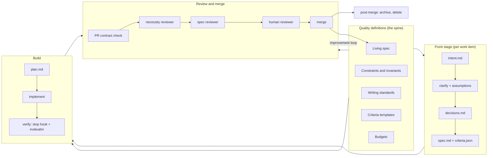

# Quality-First AI Software Delivery System

Design document, version 1. Target: Claude Code only, GitHub, one monorepo.

Status of this document: core and Appendix B are complete for Python 3.14 managed with uv, linted with Ruff, tested with pytest (the uv convention; a package that uses a different runner declares its test command in its own `pyproject.toml` and the design reads it from there). Remaining placeholders are GitHub usernames in CODEOWNERS and budget numbers that need a baseline.

Field claims (review-time data, harness results, practitioner patterns) are cited with URLs in the companion overview document's References section. Claude Code facts in this document were checked against the official references on 2026-09-11: hooks (https://code.claude.com/docs/en/hooks), GitHub Actions (https://code.claude.com/docs/en/github-actions), plugins via the Agent SDK reference (https://platform.claude.com/docs/en/agent-sdk/plugins). Event names, exit-code semantics, and settings precedence should be re-checked against those pages before implementation, since they change between releases.

The build that implemented this design, and the review that followed it, are recorded in
`docs/history/template-v2/`: intent, clarification, spec and criteria, plan, the decision
log (D1 to D44, extending the register below), and the issue log. Reference material, not
tests -- this repository is a template and does not run the delivery process on itself.

---

## 0. Decision register

Every decision made during the design conversation, with the section that implements it. Use this to check coverage.

| # | Decision | Section |
|---|----------|---------|
| 1 | Quality is defined before work; the written definitions are the spine, everything downstream checks against them | 1, 4 |
| 2 | Claude Code only; all automation uses its own primitives (CLAUDE.md, skills, commands, subagents, hooks, plugins, headless mode) | 12 |
| 3 | Deterministic checks wherever possible; LLM judgment only where mechanical checks cannot reach; no probabilistic control is a sole gate | 1.1 |
| 4 | Human attention is the budgeted resource; it concentrates at gates and at the front stage | 1.2, 5, 8 |
| 5 | Durable state lives in files; chat history is never load-bearing | 1.3, 3 |
| 6 | Each component is tagged compensation (expires with model improvement) or policy (permanent) | 1.4, 15 |
| 7 | Two writing standards, one per audience (model-facing, human-facing), enforced mechanically where possible | 10 |
| 8 | Three workflows by scope: Project, Change (with diagnosis variant), Trivial; risk is a modifier on Change, not a fourth workflow | 6 |
| 9 | Change workflow review model: one overseer, one PR reviewer; overseer accepts own intent and spec; second reviewer only at high-risk tier | 6.3, 8 |
| 10 | Oversight consists of recorded acceptance acts the agent cannot write | 5.5 |
| 11 | Front stage: intent, clarify (contradictions first, bounded questions, assumptions log), decisions log with rejected alternative and ramification, spec with computed criteria | 5 |
| 12 | Coverage is a spec-stage problem: explicit edge and negative criteria, spec reviewer checks against intent | 5.4 |
| 13 | Diagnosis stage for defects: reproduction, evidence links, claims tagged observed/inferred/hypothesized, fix blocked until cause confirmed, committed failing test with CI-verified ordering | 6.4 |
| 14 | Done is computed: all criteria pass with evidence, evaluator confirms, no blocking items open | 7.3 |
| 15 | No open-ended "find issues" prompts anywhere; every review prompt asks closed questions with stopping conditions | 1.5, 8.2 |
| 16 | A finding must cite a written rule it violates or it is a preference and is not recorded | 9.1 |
| 17 | Observations (residual) carry a consequence with provenance; hypothesized dropped at write time; observed routes to defect; inferred expires at next entropy audit | 9.2 |
| 18 | Optimality only via budgets stated as criteria; no budget means not optimized by decision | 9.3 |
| 19 | Work-item artifacts live in `.work/<id>/` on the branch, travel with the PR, are archived after merge, ephemeral parts deleted | 3.2 |
| 20 | Promotion of lasting value decided at write time via scope tags, drafted inside the PR, checked by CI | 8.4 |
| 21 | Living spec is the durable behavior description; PR contract requires it updated in the same PR | 4.1, 8.1 |
| 22 | Living-spec, constraints, standards, criteria templates, and budgets are the primary artifacts | 4 |
| 23 | Three enforcement tiers: in-session hooks, GitHub rulesets and CI, process improvement loop | 11 |
| 24 | Tests, criteria files, standards, and constraints are protected paths: blocked in-session, code-owned in CI | 11.2 |
| 25 | Change tiers computed from the diff; raise freely, lower only with a logged label | 6.5 |
| 26 | Break-glass path with mandatory post-hoc artifacts | 6.6 |
| 27 | Every bypass is a labeled, logged exit; bypasses and CI rejections feed the improvement loop | 11.3 |
| 28 | Subagents only as judges with fresh context and read-only tools; no multi-agent orchestration | 12.2 |
| 29 | Enforcement hooks are deterministic shell; LLM hooks avoided on high-frequency events | 11.1 |
| 30 | One branch per Change work item with stage commits; Project artifacts get their own PR; Trivial has no stage commits | 3.3 |
| 31 | Transcripts, traces, and subagent reports stay out of the repo, referenced by ID | 3.4 |
| 32 | Post-merge job archives and deletes; promotion happens before merge | 3.2, 8.4 |
| 33 | Adoption workflow for the existing monorepo to bootstrap the living spec and constraints | 13 |
| 34 | Acceptance recorded as human-authored commit with structured trailer plus PR approval | 5.5 |
| 35 | Traces exported via OpenTelemetry; design specifies what to capture, not the store | 7.6 |
| 36 | Managed settings status unknown: design specifies both configurations and how to verify which applies | 11.1 |
| 37 | Rollout: constraints and stop hook first, then front stage, then review, then workflows | 14 |
| 38 | Model-facing files stay short (root CLAUDE.md well under 300 lines), never duplicate linter rules, use progressive disclosure and file:line references | 10.1 |
| 39 | Verifier deadlock: capped retries then escalation with evaluator report | 7.3 |
| 40 | Exploration is exempt from stage blocks on spike branches; nothing merges from a spike branch directly | 6.7 |
| 41 | Ruff has no custom-rule support; constraints are split across Ruff built-ins (budgets), import-linter (layer contracts), and a repo-owned AST checker (invariants with remediation messages) | 7.2, B.1 |
| 42 | No UI: end-to-end criteria exercise the package's public entry point (CLI or API) as a client would | 7.3 |
| 43 | Logs in GCP Logging: the diagnosis stage reads them through an allowlisted `gcloud logging read`; traces export via OpenTelemetry to Cloud Trace | 7.5, 7.6 |
| 44 | Break-glass follow-up is created automatically but its due date and enforcement are a team decision per incident; CI reports open follow-ups, never fails on them | 6.6 |
| 45 | No performance budgets by default; the budget mechanism stays available for a package that needs one | 4.5 |
| 46 | Human-facing standard is derived from the deslop skill's tiers, with readability by a junior engineer without codebase context as the acceptance test; the deslop skill runs as a pass on every human-facing artifact before PR | 10.2 |
| 47 | Claude Code GitHub Action authentication is a phase 1 setup task; the production control-band trigger is deferred until monitoring exists | 12.3, 14 |
| 48 | Superseded by #93 | 11.2 |
| 49 | The plugin bundles every skill it depends on; external skills (deslop) are vendored with provenance and a sync procedure, never assumed present | 12.5 |
| 50 | Scaffold (repo files) is owned by the copier template; process (skills, hooks, agents) is owned by the plugin; versioned separately with a declared compatibility range | 17.1 |
| 51 | The system is built and tested first in a standalone test-bed repository generated from the template, against scripted scenarios with expected outcomes, before any retrofit | 17.2, 14 |
| 52 | New projects get the scaffold from the copier template; scaffold updates propagate with `copier update` | 17.3 |
| 53 | Retrofit into an in-progress repository is per-package with an enablement marker; unenabled packages run under legacy rules until a cutoff | 17.4 |
| 54 | Scaffold merges into `vholley/copier-template-python-service`; existing template files are replaced where they overlap, per the merge table | 17.5 |
| 55 | Superseded by #87 | 17.5 |
| 56 | AGENTS.md is the root instruction file (CLAUDE.md stays `@AGENTS.md`); the design's CLAUDE.md content lands in AGENTS.md | 7.1 |
| 57 | Workspace layout is the template's `libs/*` and `apps/*`; git-flow branches (`develop` target, `main` release); rulesets on both | 3.1, 3.3, 11.2 |
| 58 | Pyright strict (already in the template) joins the deterministic constraint layer; Makefile targets are the command surface hooks and CI call | 7.2 |
| 59 | For template-generated projects the process lives in `.claude/`, copier-managed; plugin extraction is deferred to the non-template case | 17.1 |
| 60 | Acceptance is a signed commit with a software SSH key protected per use; CI verifies signatures on acceptance commits only, against org members' GitHub-registered signing keys fetched at run time; no repository-wide signing requirement | 5.5 |
| 61 | Enforcement ladder: walls, labeled exits, advisory, unenforced; the trust boundary is the merge | 11.4 |
| 62 | Retroactive artifact chains are detected by an ancestry-ordering check and admitted only through the `retroactive-chain` labeled exit | 8.1, 11.4 |
| 63 | Acceptance commits are required by workflow, not per change: none for Trivial, two for Change and Defect, decisions batched into the following stage acceptance | 5.5 |
| 64 | Trivial requires no work item and no criteria file; the CI job is the criterion; tier is computed at PR time by paths, AST-equivalence, or string-constant-only diffs | 6.5, 6.9 |
| 65 | Stage guards apply only on `work/*` branches; other branches edit freely and are classified at PR time | 11.1 |
| 66 | A PR bounced from Trivial to Standard is a `bounced` labeled exit: chain required, ordering check waived, no code-owner approval, logged | 6.5, 11.4 |
| 67 | One entry point (`make start` / `/start`) with a four-answer question; the engineer never chooses a tier; engineer-facing names are quick change, change, bug fix, new project | 19.1 |
| 68 | Every block, from any tier, emits the same four-line message (BLOCKED, WHY, NEXT, MORE); a block without an exit is a defect | 19.2 |
| 69 | `make status` and the session-start message answer "where am I and what is next" at every stage; the state machine has no dead ends and `make abandon` exits any state | 19.3 |
| 70 | `working/README.md` carries the one-screen explanation of when each process applies; no other page is required reading | 19.4 |
| 71 | `make start` is contextual: answers depend on branch and tree state; "new project" exists only in `copier copy`, never inside a repository | 19.1 |
| 72 | Running `/start` is the agent's responsibility, by AGENTS.md rule, so an engineer who never learns the command still gets the harnessed workflow; a soft nudge on non-work branches is advisory | 19.1, 11.1 |
| 73 | Outside `work/*` branches the only in-session refusals are protected-path edits and the green gate; the process is met once, at PR time, via the bounce | 19.5 |
| 74 | `make green` (autofix, lint, types, tests, constraints, budgets for touched members) is the verification gate the stop hook runs; `make green` is retired | 7.3 |
| 75 | TDD is the implementation discipline of the Change workflow: a `red` stage after `plan` commits a failing test per criterion; `green` implements per step | 6.2, 7.8 |
| 76 | Red-first is enforced for every criterion by the ordering check (test fails at its own commit, passes at head); test-quality rules and a diff-coverage budget are deterministic; mutation sampling at the high-risk tier | 7.8, 8.1 |
| 77 | `Accept: red` is a third signed acceptance for Change: the overseer accepts the tests as the executable criteria | 5.5, 7.8 |
| 78 | Acceptance commit contract: subject `accept(work-<id>): <stage>`, agent-written body, `Accept:` trailer with the artifact hash, only `.work/<id>/` files; the agent prepares, the engineer signs | 5.5 |
| 79 | No change is co-authored by an LLM; every change is one engineer's responsibility; `includeCoAuthoredBy` off; CI rejects LLM co-author trailers | 5.5, 12.3 |
| 80 | `enable_delivery` copier question; every template part independently selectable | 17.1 |
| 81 | Migration support for existing generated projects: `MIGRATION.md`, `_message_after_update`, `scripts/migrate-to-delivery.sh` | 17.3 |
| 82 | Human review is requested one artifact (or one part) at a time, one substantial question or up to three small ones per turn; enforced by skills and an AskUserQuestion hook | 1.2, 19.6 |
| 83 | The LLM is a tool, not an engineer: every commit has an engineer as author; engineer-triggered headless runs author as the triggering engineer; unattended runs never commit; headless runs never sign | 1.7, 12.3 |
| 84 | Work items bind to a branch by `state.json`, not by branch prefix; branch names are free (ticket keys); spikes are a workflow value | 3.3, 11.1, 12.4, 19.1 |
| 85 | Nothing from the delivery system is deployable: root `.dockerignore`, explicit Dockerfile `COPY` lists, and `deploy_surface.py` in CI | 3.4, 17.5 |
| 86 | The system overview ships in every generated project as `docs/DELIVERY-SYSTEM.md` | 3.1 |
| 94 | One author, one non-author approval, always; no path or tier ever requires two approvals; high-risk moves the reviewer's spec look before implementation instead of adding people | 6.5, 8.3, 11.2 |
| 93 | Optional `owner_group` question; when set, CODEOWNERS auto-requests that group's review on protected paths without adding an approval requirement; when empty, no file | 11.2, 17.1 |
| 100 | Test directories and the living spec are not in the in-session edit block; the ratchet and review protect them (D37) | 11.2 |
| 99 | Decision entries follow the five-question human-readable format; the human-facing standard and deslop apply to decisions.md; the review subagent checks that each can be restated in one sentence | A.3 |
| 98 | Test identity is the living-spec anchor only; no criterion markers; criteria link to tests through criteria.json for the life of the item | 7.8 |
| 97 | Opt-out: a signed acknowledgment leaves the process for a branch; the agent offers it and does not argue; repository checks and the non-author approval remain; logged by reason | 6.11 |
| 96 | Signatures only at stage gates; decisions batched into the next gate's commit (implementation-stage decisions into one commit at PR preparation); approval is a chat act, signature a batch act | 5.5 |
| 95 | `docs/` holds supplementary, unchanging reference (untracked); `working/` holds what the process reads and writes; the workflow diagram is reference and lives in `docs/` | 3.1 |
| 92 | Make/slash parity from one registry (`working/commands.toml`) with a runner field; human-only acts hand off from the slash form (`/accept` prepares, `/abandon` confirms) | 19.7 |
| 91 | Commands are discoverable by mechanism (`make help`, `/help`, `make status` next commands, block NEXT lines, README table generated from command frontmatter); the workflow diagram ships as `working/workflow.mermaid` | 19.7 |
| 90 | Amendments are a side loop scoped per criterion with re-acceptance of only the affected part; a size guard routes large ones to the `spec` exit; causes feed the improvement loop | 6.10 |
| 89 | No silent decisions: every decision is recorded when made; blocking approval for build-changing ones, batched approval at the next gate for the rest; unrecorded is a violation | 1.8 |
| 88 | state.json is a derived cache: rebuildable from git and artifacts, consistency-checked on every read with a repair command, atomic writes, CI cross-checks rebuild against the committed file | 12.4 |
| 87 | Reverses #55: `docs/` stays untracked with the template's meaning (generated reference docs); all durable delivery artifacts live in a tracked `working/` directory; the one-page process guide is `working/README.md` so it exists on a fresh clone | 3.1, 17.5 |

---

## 1. Principles

The system exists to produce software that is correct against a written definition of quality and to give humans justified trust in it. Every mechanism below is a consequence of one of these principles. When a future decision is not covered by this document, resolve it against them.

### 1.1 Deterministic before probabilistic

A control is either deterministic (a linter, a structural test, a schema check, a branch ruleset: same answer every time) or probabilistic (any LLM judgment). Böckeler's harness-engineering article on martinfowler.com calls these computational and inferential controls (https://martinfowler.com/articles/harness-engineering.html). Everything that can be checked deterministically is. LLM judgment is spent only on what mechanical checks cannot reach, and no probabilistic control is ever the sole gate for anything that requires trust. Each mechanism in this document states which kind it is.

### 1.2 Human attention is the budget

Code generation is cheap and parallel. Human judgment is serial and expensive. The system is designed around where human attention goes: concentrated at the front (defining quality) and at gates (confirming it was met), and removed from everything mechanical. Every stage is judged by the question: what does the human have to read here, and is it the smallest thing that lets them decide?

Attention is also budgeted per turn. When the process asks a human for review or an answer, it asks for one artifact, or one part of one artifact when the artifact is long, and it asks one substantial question or up to three small ones. Presenting a whole chain at once produces shallow feedback on all of it. Section 19.6 states the mechanism and the enforcement.

### 1.3 Durable state lives in files

The context window is ephemeral. Anything that must survive a session, a compaction, or a handoff lives in a versioned file with a path. Knowledge that is not in the repository is invisible to the agent. Decisions made in chat, Slack, or meetings do not exist until written into the repository.

### 1.4 Compensation versus policy

Some components exist because the current model cannot do something unaided (loop detection, forced verification, startup directory maps). These expire as models improve and are tagged `compensation`. Others encode the team's decisions (architecture layers, standards, the PR contract). These are permanent and tagged `policy`. Section 15 lists every component with its tag.

### 1.5 Standards are written, and only written standards generate work

An agent asked an open question ("what is wrong with this?") produces findings in proportion to the asking, not to the defect rate, because it is allowed to supply the standard being violated. Therefore:

- The agent is never asked open questions. Every review, evaluation, and inspection prompt asks closed questions with a stopping condition (does criterion X hold; is hunk Y required by a criterion; does file Z violate constraint W).
- Nothing is a finding unless it names the written rule it violates. A concern with no rule is a preference, and preferences are not recorded.
- If the team believes something matters, the response is to write the rule. An unwritten standard cannot generate work.

### 1.6 Claims carry provenance

A statement about a cause, a consequence, or a fact about the system is tagged `observed` (linked evidence), `inferred` (derived from named observations), or `hypothesized` (no evidence). Action is gated on provenance: fixes require an observed or confirmed cause; observations with hypothesized consequences are discarded at write time.

### 1.7 The LLM is a tool; every change has an engineer

No commit is authored by an LLM or a bot. Every change in the repository is the work, and the sole responsibility, of the engineer under whose identity it was made. In an interactive session that is the engineer at the keyboard. In a headless run triggered by an engineer's act (an intent acceptance push, a manual dispatch), it is the triggering engineer, taken from the event. A run with no triggering engineer, such as the scheduled audit, does not commit; it produces drafts an engineer adopts and thereby authors. Headless runs never hold a signing key, so a tool can commit but only an engineer can accept.

### 1.8 No silent decisions

A decision is any choice between alternatives a reviewer could reasonably disagree with: behavior, structure, interfaces, dependencies, data shape, defaults, process, what a test asserts. Formatting, local names, and the order of independent steps are not decisions; the formatter and the written standards own them. Every decision the agent makes is written to decisions.md when it is made, with the rejected alternative and the ramification. Approval is blocking when the decision changes what is built, adds a dependency, changes an interface, or is one a future engineer would re-propose; otherwise it is batched into the next acceptance commit as an `Accept-Decision:` trailer, and the agent may proceed on the recorded assumption because the entry states what to undo. An unrecorded decision is a violation. Enforced by AGENTS.md, by the necessity reviewer (which decision entry covers this dependency, interface, or default), and by EXP-10.

---

## 2. System overview



Reading order for a new engineer: section 4 (what quality means here), section 6 (which workflow applies to their task), section 5 (what they produce before code), section 8 (what a reviewer does). Everything else is infrastructure.

---

## 3. Repository layout

### 3.1 Durable locations (monorepo root)

The layout follows the copier template (section 17.5): a uv workspace with members `libs/*` and `apps/*`, an `app-template/` that `scripts/new-app.sh` copies to create a new app, and `libs/shared` for config, logging setup, and (when `use_gcp`) the GCP client. Two directories hold text: `docs/` is the template's untracked, regenerated reference material; `working/` is the tracked home of everything the process depends on.

```
AGENTS.md                      # root instruction file (template convention); short, points elsewhere
CLAUDE.md                      # contains only "@AGENTS.md" (template convention, unchanged)
Makefile                       # the command surface: lint, typecheck, test, plus the targets added below
.claude/
  settings.json                # project hooks and permissions (Tier 1)
  rules/                       # path-scoped rules loaded on demand
  commands/ skills/ agents/    # the process (section 12)
working/                       # TRACKED: the durable delivery artifacts (register #87)
  README.md                    # the one-page process guide (19.4); MORE links point here; links to docs/workflow.mermaid
  architecture/
    overview.md                # system map, domains, layer model
    constraints.md             # dependency rules, invariants, protected paths, grandfathered list
    decisions/                 # ADR-NNNN-title.md, append-only
  spec/
    <lib-or-app>/*.md          # living specification of behavior, per workspace member
  standards/
    model-facing.md human-facing.md criteria-templates.md budgets.md
  history/<work-id>/           # archived work-item records (not loaded by default)
  observations.md              # residual observations with expiry (section 9.2)
docs/                          # UNTRACKED, as in the template: supplementary reference that never changes, restored by scripts/restore-from-template.sh
  CONVENTIONS.md DEVELOPING.md RATIONALE.md SETUP.md DELIVERY-SYSTEM.md workflow.mermaid
libs/<name>/                   # src/<name>/, tests/, pyproject.toml with [tool.delivery]
apps/<name>/                   # same shape; created by scripts/new-app.sh
scripts/                       # bootstrap.sh, new-app.sh (template) plus the delivery scripts (B.1, B.2)
.github/
  CODEOWNERS
  pull_request_template.md     # replaced by the A.7 template
  workflows/                   # ci.yml (template, extended) plus the delivery workflows (B.3)
.pre-commit-config.yaml        # template hooks plus constraints, budgets, spec-coverage
.dockerignore                  # excludes .claude/, .work/, working/, docs/, scripts/, .github/, tests, *.md
.work/<work-id>/               # active work-item records (on branch only)
```

The delivery plugin (skills, commands, agents, hooks) lives in its own repository and is installed into the monorepo. It is versioned separately from the code it governs.

### 3.2 Work-item records and their lifecycle

Each work item has a directory `.work/<work-id>/` on its branch:

| File | Purpose | After merge |
|------|---------|-------------|
| state.json | Current stage and legal transitions (section 12.4) | Archived |
| intent.md | What, why, constraints, non-goals, what done means | Archived |
| clarify.md | Questions asked, answers, assumptions with risk, doc-gap tags | Archived; doc-gaps already promoted in PR |
| decisions.md | Each decision with rejected alternative, ramification, scope tag, acceptance | Archived; durable entries already promoted in PR |
| spec.md | Delta against the living spec | Archived; living spec already updated in PR |
| criteria.json | Default-FAIL acceptance criteria with evidence links | Archived |
| plan.md | Ordered steps, each mapped to criteria | Archived |
| diagnosis.md | Defect items only (section 6.4) | Archived; rejected hypotheses promoted where tagged |
| progress.md | Session handoff notes | Deleted |

Lifecycle: created by the `/intent` command, carried through stage commits, validated by CI in the PR, then a post-merge job moves the directory to `working/history/<work-id>/` minus progress.md. Nothing in `working/history/` is loaded by default; CLAUDE.md names it as the place to look when asked why something was done.

### 3.3 Branches and PRs

Branch names are free; teams typically name them after tickets. What binds a branch to the process is a work item: `.work/<id>/state.json` records `branch`, and hooks and CI apply the item's rules to that branch. `make start TICKET=<key>` uses the ticket key as the work-item id and as the default branch name.

| Workflow | Branch model | PRs |
|----------|-------------|-----|
| Change | One branch per item off `develop`, bound by `state.json`; stages as sequential commits (intent accepted, spec accepted, red accepted, implementation) | One PR to `develop` carrying the full chain; one non-author approval |
| Project | Architecture artifacts on a branch bound to the project item; approval is the merge to `develop` | One PR for architecture; then one Change branch per emitted work item |
| Trivial | Any branch with no work item | One PR; CI job plus one-line description |
| Spike | Any branch with a work item whose `workflow` is `spike`; stage hooks do not apply | Never merged directly; `make start` converts it to a Change or defect item |

The template uses git-flow branches: `develop` is the default and integration branch, `main` is the release branch. Work-item PRs target `develop`. Release PRs from `develop` to `main` carry no work-item artifacts and are checked only by the standard CI job and the ruleset; the process gates are on entry to `develop`.

### 3.4 What stays outside the repository

- Anything deployable: a root `.dockerignore` excludes `.claude/`, `.work/`, `working/`, `docs/`, `scripts/`, `.github/`, `**/tests/`, and `*.md`; app Dockerfiles copy an explicit list (`pyproject.toml`, `uv.lock`, `libs/`, `apps/<app>/`); `scripts/deploy_surface.py` in CI fails any Dockerfile that copies outside that list and, where Docker is available, any image containing an excluded path. Skills, work-item records, and process documents never reach an artifact that Terraform deploys.
- Session transcripts and traces: observability store, referenced from the PR by run ID.
- Evaluator and reviewer subagent reports: posted as PR check outputs or comments for the specific revision, not committed.
- Secrets and environment state.
- The plugin source (own repository).

---

## 4. Quality definitions (the spine)

These are the primary artifacts. The Project workflow produces them for a new codebase; the adoption workflow (section 13) bootstraps them for the existing monorepo; the Change workflow extends them with every spec. Everything else in the system reads them and checks against them.

### 4.1 Living specification (`working/spec/`)

A current description of what the system does, organized by domain, written to the model-facing standard. It is the reference against which defects are defined (a defect is a violation of the living spec) and against which each work item's spec.md is a delta.

Rules:
- Every behavior visible to users or other components is described here, with its edge and failure behavior.
- The PR contract (section 8.1) requires any change to described behavior to update the living spec in the same PR.
- Each domain file carries a length budget (budgets.md); over budget, split by subdomain.
- Statements are declarative and testable. "The service rejects requests over 1 MB with HTTP 413" rather than "large requests are handled."

### 4.2 Constraints and invariants (`working/architecture/constraints.md`)

The rules that hold everywhere and are enforced mechanically:
- Layer model and permitted dependency directions between layers, per domain. The reference shape (adapt to the stack): Types → Config → Repo → Service → Runtime → UI, forward only; cross-cutting concerns through a single provider interface.
- Invariants: statements that must always be true (for example: all external input is parsed at the boundary; no service layer imports a UI module; no direct database access outside the repo layer).
- Protected paths: files that only humans may change through code-owned review (section 11.2).
- Each constraint names the check that enforces it (lint rule ID or structural test name). A constraint without a check is a defect in this file and is fixed by writing the check, not by asking the agent to comply.

The rule of thumb for what belongs here: enforce invariants, do not micromanage implementations. Require that input is parsed at the boundary; do not specify which library.

### 4.3 Writing standards (`working/standards/`)

Section 10 specifies both standards. They are quality definitions because every artifact the agent reads or writes is checked against them.

### 4.4 Criteria templates (`working/standards/criteria-templates.md`)

For each change type, the criteria a spec must include. A spec that lacks a required criterion class fails the spec check. Minimum set:

| Change type | Required criteria classes |
|-------------|--------------------------|
| New behavior | Positive (happy path), negative (rejected input, unauthorized, not found), failure (dependency down, timeout), boundary (limits, empty, maximum), and any budget that applies |
| Changed behavior | All of the above for the changed surface, plus a regression criterion for each existing behavior in the touched living-spec section |
| Defect fix | The reproduction test (fails before, passes after), regression criteria for the touched section, and a criterion that the fix touches the location named in diagnosis.md |
| Trivial | None; the standard CI job is the criterion (6.9) |

Coverage is decided here and in the spec stage, before code. A gap found during implementation is either a blocking item (a criterion cannot be met) or a spec amendment (a criterion was missing), and either way a human decides it.

### 4.5 Budgets (`working/standards/budgets.md`)

Named numeric limits. A budget is the only channel through which "optimal" enters the system: a dimension with a budget is a criterion; a dimension without one is, by decision, not optimized, and the agent is told so in CLAUDE.md.

Starting set (fill numbers during adoption):
- Diff size per PR (lines changed) by tier
- New dependencies per PR (default 0 without a decision entry)
- File length, function length, cyclomatic complexity (enforced by lint)
- Root CLAUDE.md length; area doc length; living-spec domain file length
- Comment density ceiling (human-facing standard)

Performance dimensions (latency, memory) are not budgeted by default because the team does not measure them and they rarely apply. A package that needs one adds it to budgets.md with a measurement command, and it becomes a criterion for changes touching that package. Until then, performance is not optimized, by decision.

---

## 5. Front stage

The front stage runs for every Change and Project work item. It produces the definition of done before any code exists. Human effort concentrates here.

### 5.1 `/intent` → intent.md

The overseer runs `/intent <title>`. The skill creates `.work/<id>/`, writes state.json at stage `intent`, and drafts intent.md from a short conversation. The template (Appendix A.1) has five fields: what is wanted, why, constraints, non-goals, and what done means to the person asking. Non-goals are mandatory and are the first defense against scope growth.

The skill asks at most three questions before drafting, all about the why and the non-goals. It does not ask about implementation.

Acceptance: the overseer edits as needed and commits with the trailer `Accept: intent` (section 5.5). The intent-acceptance commit is what allows the next stage.

### 5.2 `/clarify` → clarify.md and assumptions

The skill reads intent.md, the living spec for the touched domains, and constraints.md, then runs the assumption filter. Order is fixed:

1. Contradictions first. Conflicts between the intent and the living spec, between the intent and a constraint, or within the intent itself. These are surfaced before anything else and block until resolved.
2. Decision-relevant unknowns second. Only questions whose answer changes what is built: a hidden assumption, an edge case, a permission or role boundary, a data lifecycle decision, a failure mode. Naming, styling, and implementation choices are excluded unless they block the feature.
3. Everything else is a stated assumption with a risk note, logged, not asked.

Bounds (compensation tag): at most five questions per round, at most two rounds. Questions are asked through AskUserQuestion with concrete options where the answer space is small. In headless runs (section 12.3) no questions are asked; every unknown becomes a logged assumption and the item cannot leave `clarify` until the overseer reviews the log.

Each answered question and each assumption is tagged `local` or `doc-gap`. A doc-gap is a question the documentation should have answered; it produces an edit to the living spec or area doc, drafted in the PR (section 8.4).

### 5.3 decisions.md

Any decision the agent proposes, at any stage, is an entry with mandatory fields (Appendix A.3): the decision, the alternative rejected, what breaks if this is wrong, the scope tag (`local` or `durable` with a `promote_to` target), and an acceptance field the agent cannot write.

The ramification field is the mechanism against blind acceptance. The overseer cannot accept an entry without the consequence of being wrong stated in front of them. An entry with an empty ramification field fails the CI check.

The agent proposes; the human decides. The agent may not proceed past a decision that is not accepted. Decisions that took a human to make are the strongest promotion candidates.

### 5.4 `/spec` → spec.md and criteria.json

The skill reads the accepted intent, clarify.md, decisions.md, the living spec for the touched domains, constraints.md, criteria-templates.md, and budgets.md. It produces:

- spec.md: a delta against the living spec, written to the model-facing standard. Declarative statements only. Each statement maps to at least one criterion.
- criteria.json: default-FAIL. Every criterion starts `"status": "fail"` with an empty evidence field. The required classes from the criteria template for this change type must be present; the skill enumerates edge, negative, failure, and boundary cases explicitly. Applicable budgets are included as criteria with a measurement command.
- Living-spec edits: drafted as the change to `working/spec/` that will land in the PR.

The spec reviewer subagent (section 12.2) runs before acceptance and answers closed questions only: does every intent statement have a criterion; does every criterion trace to an intent statement or a template requirement; are the open questions from clarify.md answered or carried forward; does any criterion contradict the living spec. Its report is attached to spec.md.

Acceptance: overseer commits with `Accept: spec`. For the high-risk tier, a second human must also approve (section 6.5).

### 5.5 Acceptance mechanics

Acceptance is a signed commit with a fixed shape. The agent prepares it; the engineer signs it.

```
accept(work-0042): spec

Accepts .work/0042/spec.md and criteria.json as the definition of done for this item.
Criteria: 7 (positive 2, negative 2, failure 1, boundary 1, regression 1). Budgets: diff 400 lines.
Decisions accepted with this commit: D1 (parse at boundary), D2 (no new dependency).

Accept: spec sha256=<64 hex of spec.md> sha256=<64 hex of criteria.json>
Accept-Decision: D1 sha256=<hex>
Accept-Decision: D2 sha256=<hex>
Work-Item: 0042
```

Rules: the subject is conventional-commit type `accept` (added to the hook's allowed types), scope `work-<id>`, description the stage name; the body is one short paragraph written by the agent to the human-facing standard, stating what is being accepted in terms a reviewer can check against the file; the trailers carry the SHA-256 of each accepted file's blob; the commit contains only files under `.work/<id>/`. Any commit whose message contains an `Accept:` or `Accept-Decision:` trailer is an acceptance commit and is held to this contract.

`make accept-prepare STAGE=<stage>` (run by the agent) stages the artifact files, computes the hashes, and writes the message to `.work/<id>/accept-<stage>.msg`. `make accept STAGE=<stage>` (run by the engineer in their own shell) verifies the staged blobs match the hashes in the message, prints the message and a short diff, and runs `git commit -S -F` on it. A signature is part of the commit object, so there is no way to sign a commit after the agent has created it without creating a new commit; the prepare/sign split is the practical form of "the agent produces it, the engineer signs it."

No change is co-authored by an LLM. Every change is captured under one engineer and is that engineer's sole responsibility. The shipped `.claude/settings.json` sets `includeCoAuthoredBy` off, and the contract rejects any commit carrying a `Co-Authored-By` trailer that names an LLM.

Why signing and not author identity: in an interactive session the agent commits under the engineer's own git identity, so the author field cannot distinguish a human acceptance from one the agent made. A signature can, provided the key requires an action per use.

Key requirements (adoption prerequisite, checked by `scripts/bootstrap.sh`): git 2.34 or later and OpenSSH 8.8 or later on every engineer machine and CI runner, because git's SSH signing runs `ssh-keygen -Y sign` and verification runs `ssh-keygen -Y verify`; every engineer's SSH key is registered on GitHub as a signing key, which is organization policy, and the key is protected per use in one of two forms: a passphrase-protected dedicated signing key not loaded into ssh-agent (signing then fails in the agent's non-interactive shell), or a key held by an agent that confirms each use (1Password SSH agent, or OpenSSH `ssh-add -c` with ssh-askpass). A key sitting in ssh-agent without confirmation lets the agent sign from the engineer's shell; bootstrap warns when it detects that configuration. Hardware keys are not assumed.

Verification (Tier 2, deterministic): the contract check builds the allowed-signers list at run time from the organization members' registered GitHub signing keys, runs `git verify-commit` on every commit carrying an `Accept:` trailer, and checks that each hashed file's content at head still matches the hash, so editing an accepted artifact invalidates the acceptance until re-signed. Only acceptance commits are verified; there is no repository-wide signing requirement, and no engineer is restricted from committing, pushing, or reviewing. Headless CI identities have no signing key, so nothing produced in CI can be an acceptance.

Ordering: the intent acceptance must be an ancestor of every commit on the branch that touches source paths, and the spec (or diagnosis) acceptance must precede the first implementation commit. A branch whose chain was written after the code fails this check and can merge only through the `retroactive-chain` labeled exit (section 11.4).

In-session (Tier 1): a PreToolUse hook on Bash blocks any `git commit` whose message contains `Accept:` or `Accept-Decision:`, so the agent cannot make the commit; the engineer makes it in their own shell. Hooks refuse to advance `state.json` without the trailer in `git log`.

Which changes need acceptances:

| Workflow | Acceptance commits | Signer |
|----------|-------------------|--------|
| Trivial | None | Nobody; PR review only |
| Change | `Accept: intent`; `Accept: spec` carrying `Accept-Decision:` for every decision made before it; `Accept: red` on the committed failing tests; decisions made during implementation are batched into one `accept(work-<id>): decisions` commit at PR preparation, only if any exist | Overseer |
| Change, defect variant | `Accept: intent`; `Accept: diagnosis` | Overseer |
| High-risk modifier | As the base workflow; the reviewer's `Spec-approved` comment is required before implementation | Overseer signs; reviewer comments |
| Project | None as commits; the architecture PR approval is the acceptance | Design review |
| Break-glass | None up front; the follow-up item takes the defect path | Named approver |
| Opt-out (6.11) | `accept(<branch>): opt-out`, one signature acknowledging the process is not used; then nothing | Engineer |

Signatures happen at stage gates only; the engineer never signs an individual decision or file edit. Approval and signature are different acts: a blocking decision (1.8) is approved by a chat answer before the agent proceeds, and the signature that records it comes in the next batch. A typical change is three signatures, a defect two, a quick change none; an implementation-stage batch adds at most one, an amendment adds one for the part it touched. Ordinary commits, clarify answers, plan.md, progress.md, and PR approval (an ordinary GitHub review) are never signed.

Oversight is defined as these acts: accepting intent, answering or accepting the clarify log, accepting each decision, accepting the spec, accepting the red tests. Watching the agent work is not oversight and is not recorded.

---

## 6. Workflows by scope

Scope decides which workflow runs. Risk decides how much review it gets. The two axes are kept separate.

### 6.1 Project workflow

Runs once at the start of something new. Produces architecture, not code.

Stages:
1. `/intent` at project scope: the product intent, constraints, non-goals.
2. `/clarify` at project scope, with the same filter.
3. `/architect`: produces `working/architecture/overview.md`, `constraints.md` (layer model, invariants, protected paths, each with its enforcing check), initial ADRs for choices that are expensive to reverse, the two writing standards instantiated for this project, budgets.md with numbers, and criteria-templates.md.
4. `/decompose`: derives the initial living spec skeleton and a feature list. Each feature becomes a Change work item with a draft intent.md, in dependency order.
5. Review: whatever the team's established design review is. The system records it as PR approval on the `project/<name>` branch, merged to main.

The Project workflow builds nothing. After merge, each emitted Change item runs the Change workflow. For a greenfield build, section 6.8 describes the outer loop that drives those items in sequence.

### 6.2 Change workflow (features and changes)

For any change to a codebase that has the quality definitions in place.

1. Front stage (section 5): intent → clarify → decisions → spec, with acceptances.
2. `/plan` → plan.md: ordered steps, each mapped to the criteria it satisfies, and the interfaces (signatures, module boundaries) the tests will be written against. Steps are sized so that one step is one commit and the whole item fits the diff budget for its tier. If it does not fit, the item is split at this point into several work items, each with its own spec.
3. `/red`: one failing test per criterion, committed, each carrying its `spec` marker or criterion ID, before any implementation. The overseer accepts with `Accept: red` (7.8).
4. `/implement` (green): one plan step at a time; each step ends green (`make green` passes) and is one commit. The stop hook (section 7.3) prevents the session from ending otherwise. Each step ends with criteria.json updated with evidence for the criteria that step satisfies.
5. Verification: the fresh-context evaluator (section 12.2) grades criteria.json against evidence.
6. PR preparation: the implement skill drafts promotions (section 8.4), the PR description (section 8.1), and the living-spec edits.
7. Review and merge (section 8).

### 6.3 Review model for the Change workflow

One author (the overseer), one reviewer who is not the author. Always exactly these two; no path, tier, or file ever requires a third person. The author's acceptances are signatures; their approval of the PR is implied by authorship and GitHub does not let them approve it anyway. The reviewer reviews the chain, not the diff (section 8.3). A wrong spec is caught at PR review at the cost of a rebuilt PR; above the size threshold in budgets.md the reviewer receives a non-blocking early look at the accepted spec, and at the high-risk tier that look becomes a gate (6.5).

### 6.4 Change workflow, diagnosis variant (defects)

A defect is a violation of the living spec, a constraint, or an accepted criterion. Anything without a rule to violate is not a defect (section 9.1).

The variant inserts a diagnosis stage between intent and plan and removes the spec stage (the spec is the living spec statement being violated).

`/diagnose` → diagnosis.md with default-FAIL fields (Appendix A.5):

- Reproduction: exact command or steps and the observed output, attached. "Cannot reproduce" is a legal outcome, must show the attempts, and closes the item as `unreproduced`, not fixed.
- Evidence: every item examined, as a link a reviewer can open (log excerpt, stack trace, bisect result, data query, a probe added to the code). Descriptions without links do not count.
- Cause claims: each tagged `observed`, `inferred`, or `hypothesized`. A hypothesis is resolved by a discriminating test: state what would be observed if true and if false, run it, record the result. The cause is `confirmed` only when it is observed or when a discriminating test resolved it.
- Confirmation test: a committed failing test whose assertion or failure message names the mechanism in the cause claim.
- Rejected hypotheses: what else was considered and what ruled it out, with scope tags for promotion.

Gates:
- Tier 1: a PreToolUse hook blocks Edit and Write on source paths for a work item in stage `diagnose` until reproduction is filled and the cause is `confirmed`. Test files and probes are permitted.
- Tier 2: CI checks out the confirmation-test commit, runs the test, and requires it to fail there; then requires it to pass at the PR head. CI also checks that the diff touches the file and function named in the cause claim; a fix elsewhere is flagged as a symptom patch and fails the check unless the diagnosis is amended and re-accepted.
- The evaluator, for defect items, answers one additional closed question: does the linked evidence support the cause claim, independent of the test now passing.

The `engineering:debug` skill's procedure (reproduce, isolate, diagnose, fix) is folded into the `/diagnose` skill's steps rather than referenced, so the plugin has no dependency on the catalog (section 12.5); the artifact and gates above are what that procedure lacks.

### 6.5 Change tier and risk tier

Two computations run in CI on every PR. Neither is declared by the engineer.

**Change tier** decides whether the front stage was required.

A PR is Trivial when any one of these holds, and none of the exclusions:
- Path rule: every changed file is under a trivial-eligible path (docs, config, dependency manifests, test files, CI) and the diff is under `diff.trivial.max_lines`.
- Non-behavioral rule: every changed Python file is AST-identical before and after once docstrings and comments are stripped (comment and docstring typos, formatting, whitespace), any path, under the trivial budget.
- String-constant rule: the only AST difference in every changed Python file is the value of string constants, the diff is under `diff.string_only.max_lines` (default 10), and no changed string value is quoted by a living-spec statement.

Exclusions: any protected path; any file under a high-risk path; any change to a dependency manifest that adds a dependency (a bump is trivial, an addition needs a decision entry).

Everything else is Standard and requires the chain. A one-line logic change is Standard because it is either a defect (which has a cause to establish) or a behavior change (which has a spec to update). The minimum Standard cost is a three-line intent, a one-criterion spec, and two signed commits.

**Bounce.** A PR opened without a work item that computes as Standard fails the contract with the reason. The engineer creates the work item and writes the chain; the ancestry ordering check (5.5) is waived for that item because the code came first; the PR carries the `bounced` label, which needs no code-owner approval and is logged into the improvement loop so the trivial rules can be adjusted if bounces cluster.

**Risk tier** modifies review depth for Standard changes.

| Tier | Trigger | Effect |
|------|---------|--------|
| Standard | Default | Change workflow as above; the reviewer sees the spec at PR time (a non-blocking early look above `spec_early_look.min_lines`) |
| High-risk | Any touched path in the high-risk list (auth, payments, data migrations, public API, security config), or `risk: high` declared in intent.md | The same single reviewer, earlier: their approval of the accepted spec (a review comment `Spec-approved` by a non-author) is required before the first implementation commit, checked by the contract; mutation sampling runs (7.8) |

An engineer may raise the risk tier freely. Lowering requires the label `tier-override`, which is logged and reviewed in the improvement loop.

### 6.6 Break-glass

For incidents. A PR labeled `break-glass` skips the front stage and the diagnosis gates. It requires a named approver from the code-owner group and the reproduction field at minimum. On merge, CI creates a follow-up work item with a draft intent.md and an empty diagnosis.md, linked to the break-glass PR.

The follow-up's due date and whether it is pursued are a team decision per incident; this system cannot judge that. CI does not fail on an open follow-up. It lists open break-glass follow-ups in the improvement-loop report (section 7.6) so the decision is made visibly rather than by default.

### 6.7 Spikes

Exploration is how engineers learn what to spec. Branches prefixed `spike/` are exempt from stage hooks. Nothing merges from a spike branch; a spike's outcome is an intent.md for a Change item, and the spike branch is deleted.

### 6.8 Greenfield outer loop

For a Project whose emitted items are built in sequence by the agent:

- A script (not a framework) drives capped sessions. Each session: read state, pick the next item in dependency order, run the Change workflow headless through plan and implement, run the evaluator, commit, reset.
- Human gates remain: intent and spec acceptance are batched by the overseer between sessions; the loop pauses at every acceptance point.
- Session cap and item-per-session rule are `compensation`-tagged.
- The Claude Agent SDK is the escape hatch if the script needs more than shell can express; it exposes the same hook events as in-process callbacks.

### 6.9 Trivial workflow

No intent, clarify, spec, work item, or `.work/` directory. The engineer or agent branches off `develop` under any non-`work/` name, makes the change, commits, and opens a PR with a one-line description of what and why. CI computes the tier (6.5). For a Trivial PR the contract checks three things: the standard CI job is green, the description is present, and the diff satisfies the trivial rules. One approval under the ruleset, then merge. The CI job is the criterion; no criteria file exists.

With the agent: stage guards do not apply outside `work/*` branches (11.1), so "fix the typo in the CLI help text" on a `fix/` branch is one prompt and one commit; the stop hook still requires `make green` to pass before the turn ends.

---

## 7. Shared core

### 6.10 Amendments: mistakes found later

An amendment is a change to an accepted artifact after acceptance. Most work items will need one; the path is cheap by construction so that the chain keeps describing what was built.

The stage does not move backward. `/amend` runs as a side loop: it classifies the cause (mistake, discovered fact, missing criterion, wrong interface), records a blocking decision entry with the change and its ramification, applies the edit, and requests re-acceptance of exactly the affected part under the one-artifact rule (19.6). Scope is at the criterion level, since criteria.json joins spec statements, tests, plan steps, and hunks: amending a criterion invalidates the red acceptance for its test only.

| Found wrong | Action | Acceptance |
|-------------|--------|-----------|
| Missing criterion | Add criterion and its red test | `accept(work-<id>): spec-amendment` and `red-amendment` for the additions; ordering check applies |
| Wrong criterion or test | Edit; if current code already passes the new test, class it `regression` and say so in the entry | Re-accept that criterion and test |
| Wrong assumption (clarify) | Record the corrected fact, tag `doc-gap`, amend dependent criteria | As above per criterion |
| Wrong interface (plan) | Decision entry and edit; amend affected red tests | Red re-acceptance per test |
| Wrong intent "what" | `implement → spec` exit; re-specify | New spec and red acceptances |
| Wrong intent "why" | `abandon`; new item referencing the old | New item |
| Found after merge | Defect item; diagnosis records which upstream artifact was wrong | Defect path |

Size guard: an amendment touching more than `amend.max_criteria` (default 3) or the intent's "what" is refused as a side loop and the `spec` exit is named instead.

Every amendment carries its cause, and the improvement loop (7.6) asks which written definition was missing: a missing criterion points at the criteria template, a wrong assumption at a doc gap, a wrong interface at the plan skill, a wrong test at the test-quality rules. Amendment counts by cause per item are the direct measure of the front stage's quality.

### 6.11 Opting out of the process

Any engineer may leave the process for a branch, at any point, by signing an acknowledgment. `make opt-out` (or `/opt-out`): the agent prepares `.work/<branch-slug>/opt-out.md` (branch, date, and the engineer's one-line reason if given) and the commit `accept(<branch>): opt-out` with trailer `Opt-Out: sha256=<hash>`; a bound work item is archived as `abandoned` first; the engineer signs with `make accept STAGE=opt-out`. That signature is the acknowledgment.

After it, on that branch: no stage guards, no nudge, no stop-hook criteria checks, no artifact chain at merge. The PR is labeled `opted-out` and the contract checks only that the opt-out commit is signed by a non-CI key and the record is present. What stays is what belongs to the repository, not the process: the ordinary CI job (lint, types, tests), the protected-path block and test ratchet, and one non-author approval. Opting out grants freedom of method, not a route around the repository's own checks.

The agent offers the exit. AGENTS.md rule: when the engineer says, in any words, that they do not want the workflow for this work, the agent replies with the canonical opt-out text below, verbatim in substance, and does not argue; and every stage-guard block names `make opt-out` as its last `NEXT` option.

```
To opt out of the process for this branch:

  1. make opt-out
     Optional: make opt-out REASON="<one line>"
     I prepare the record and the commit message. A work item on this
     branch is archived, not deleted.

  2. make accept STAGE=opt-out
     Run this in your own shell; it signs with your SSH key. I cannot
     run it for you.

To rejoin later: make start
```

The reason is optional; when given it is recorded and logged into the improvement loop by reason, since repeated opt-outs at the same stage for the same cause mean the process is wrong there. The record archives to `working/history/` after merge. What remains after opting out is stated in `working/README.md` (the repository's CI job, the test ratchet, the protected-path block, one non-author approval), not in the reply.

### 7.1 Repository knowledge

The template's convention is that `CLAUDE.md` contains only `@AGENTS.md`, so that Claude Code, Gemini CLI, Copilot, and other tools read one file. The design keeps that: `AGENTS.md` is the root instruction file and everything this document says about CLAUDE.md applies to it. The template's current AGENTS.md already states, in prose, several rules this system enforces mechanically (one task one scope, note everything else and act on nothing else, split PRs by change type, never bundle cleanup); those lines stay, shortened, with a pointer to the check that now enforces each.

Root `AGENTS.md` (policy): under 150 lines, target under 80. Contents in order: the exact build, test, lint, and verification commands as Makefile targets (`make lint`, `make typecheck`, `make test`, `make constraints`, `make budgets`, `make spec-coverage`, `make green`); the workflow entry points (`/intent`, `/diagnose`, `/trivial`) and the rule that no source edit happens outside a work item; pointers to `working/architecture/overview.md`, `constraints.md`, the standards, and budgets; the statement that dimensions without budgets are not optimized; the rule that every block message is relayed to the engineer verbatim before stopping (19.2); the rule that the agent runs `/start` before editing source on a branch with no work item unless the task is a quick change (19.1); the rule that no decision is made without a decisions.md entry (1.8); the rule that an engineer who does not want the workflow is told how to opt out and is not argued with (6.11); the location of `working/history/` and when to read it. Nothing task-specific. Nothing a linter enforces. File:line references, never pasted code.

`.claude/rules/`: path-scoped rules that load only when the agent touches matching paths (domain conventions, per-area verification commands).

SessionStart hook (compensation): prints the directory map (top two levels), the last ten commits, and the current work item's stage and next legal action, so the session does not spend turns on discovery.

### 7.2 Mechanical constraints

Every constraint in `constraints.md` has an enforcing check. Checks run in three places: pre-commit; a PostToolUse hook on Edit and Write that runs the checks on the touched file and returns violations to the agent (exit 2 so the model sees the message); and CI as the final gate.

The template already runs Ruff and Pyright in strict mode through Makefile targets and pre-commit, and the delivery checks are added as further targets so hooks, pre-commit, and CI all call the same commands. Pyright strict is part of the deterministic layer: type errors are constraint violations, and its messages already name the fix.

Ruff implements all its rules natively and has no plugin or custom-rule mechanism, so the remaining checks are split across three tools by what each can express (details in Appendix B.1):

- Ruff (built-in rules): everything Ruff already covers, including the budget rules (function length and statement count, argument count, cyclomatic complexity via `C901`, and the `PL` group), import sorting, and simple bans via `flake8-tidy-imports` (`TID251` banned-api, `TID253` banned module-level imports), which accept a custom message per banned name. Ruff messages for its own rules are fixed; the remediation for those lives in `.claude/rules/` keyed by rule ID.
- import-linter: layer contracts and forbidden-import contracts between packages and modules, declared in `pyproject.toml`. This is the dependency-direction check. Contract names and descriptions carry the remediation text.
- `scripts/constraints.py`: a repo-owned checker built on the standard library `ast` module for invariants neither tool can express (for example: external input parsed at the boundary, no direct database access outside the repo layer, no `print` in library code). Each rule has an ID, a link to its constraint anchor, and a message written to the model-facing standard: what rule, what to change, and a file:line reference to a correct example.

The rule for adding a constraint: use Ruff if a built-in rule exists; else import-linter if it is about who may import whom; else `constraints.py`. A constraint with no check in one of the three does not go into `constraints.md`.

Test ratchet (policy): CI fails any diff that deletes a test, removes an assertion, or weakens an assertion (detected by AST diff on test files) unless the label `test-change-approved` is applied by someone other than the author.

### 7.3 Verification

`make green` is the verification gate: for the touched members it runs autofix (`ruff check --fix`, `ruff format`), then lint, Pyright strict, the member's test command (exit 5 is a failure for enabled members, D3), `constraints.py`, `budgets.py`, and `spec_coverage.py`, and prints the first failure in the 19.2 format. `make ci` is the whole-workspace version without autofix. "Green" is the state every plan step must reach before its commit.

Stop hook (compensation, deterministic): fires when the agent tries to end its turn during `red` or `implement`. It exits 2 with a reason when any of the following hold: criteria.json has criteria marked `pass` without evidence links; `make green` has not passed since the last edit (checked by comparing timestamps in a run log the hook maintains); or the working tree has uncommitted changes to source. During `red`, "green" means lint and types pass and the new tests fail. Returns 0 once all clear.

Deadlock guard: the hook counts blocks per session. At the retry cap in budgets.md it stops blocking, writes an escalation entry to progress.md with the evaluator's last report, and lets the session end. The item's state records `escalated`.

Fresh-context evaluator (probabilistic, section 12.2): a subagent with Read, Grep, Glob, and Bash restricted to test and measurement commands; no Write or Edit. It grades criteria.json one criterion at a time: for each, does the linked evidence demonstrate the criterion. It cannot mark a criterion `pass` without opening the evidence. Its output is the criteria file with an `evaluator` field per criterion and nothing else.

Done is computed: all criteria `pass` with evidence, evaluator field `confirmed` on each, no blocking items open, lint clean, living spec updated. The stop hook and the evaluator grade only criteria; they have no field for anything else.

End-to-end: there is no UI. Where the change touches a package's public entry point (a CLI command, an HTTP or RPC endpoint, a public function of a library package), the criteria template requires at least one criterion verified by exercising that entry point as a client would (a subprocess call to the CLI, a request to a running instance, or an import-and-call from outside the package), not only unit tests of internals.

### 7.4 State and handoff

progress.md is written at the end of every session and read at the start of the next. Contents: what was done, what is next, what is blocked, run IDs for traces. Deleted at merge. Commits are per plan step with messages to the human-facing standard.

### 7.5 Tools

The tool surface is minimal. Connected for the agent: the GitHub MCP server (CI status, PR comments) and, for the diagnosis stage, read access to GCP Logging through an allowlisted Bash pattern (`gcloud logging read` with a fixed project and a read-only service account) rather than a general-purpose GCP MCP server. Log query results are attached to diagnosis.md as evidence links (the query and the returned entries). No browser automation, since there is no UI. Every tool or server added must reference a trace showing that its absence caused a failure. A tool nobody can justify with a trace is removed at the next entropy audit.

### 7.6 Observability and the improvement loop

Traces are exported through Claude Code's OpenTelemetry support to an OpenTelemetry Collector that forwards to GCP Cloud Trace and Cloud Logging, so agent traces sit next to the application logs the diagnosis stage already reads. Captured per session: work item ID, stage, tool calls with inputs and results, hook blocks with reasons, evaluator reports, token and time cost. The PR carries the run IDs.

Improvement loop (policy), on a fixed cadence:
1. Collect: hook blocks, CI rejections, tier overrides, break-glass uses, escalations, evaluator disagreements with the human reviewer, and any production defect.
2. For each, ask which written definition was missing or wrong: a criterion template, a constraint, a budget, a standard rule, a CLAUDE.md line, a lint message.
3. The fix is a change to the definition or the check, logged with the trace that motivated it. A change to a prompt is the last resort.
4. Every component change records its tag (compensation or policy).

Baseline metrics captured before rollout: cost per merged PR, time to merge, revert rate, review comments per PR, PR size distribution, production defects per month.

### 7.7 Entropy audit

A scheduled headless run (weekly to start). It answers closed questions only:
- Does any file violate a constraint that was added after it was written?
- Does any living-spec statement lack a corresponding test?
- Does any area doc or CLAUDE.md line describe something the code no longer does?
- Does any decision record refer to code that no longer exists?
- Is any observation in `working/observations.md` past its expiry?
- Is any MCP tool unreferenced by any trace since the last audit?

Its output is one PR per class of violation with the constraint or rule cited, plus deletions of expired observations. It also applies the deletion rule to instructions: if traces show the agent behaving correctly in the absence of an instruction, the audit proposes removing it.

### 7.8 Test-driven development as the implementation discipline

The Change workflow is test-driven: every criterion gets a failing test before any implementation, and implementation proceeds one plan step at a time until green. This is the general form of two rules already in the design (criteria map to tests; defects begin with a failing test), and it makes the thing the overseer accepts an executable definition rather than prose.

Stages: `plan` decides interfaces; `red` writes one failing test per criterion, committed, marked with the spec anchor it proves and listed in the criterion's `tests`; `Accept: red` by the overseer; `green` implements per step. The defect variant is the same with the diagnosis confirmation test as the red test.

Adherence is checked, not requested:

- Red-first ordering (deterministic, contract item 9): for each criterion, CI checks out the commit where its test was added, runs it, and requires failure; then requires it to pass at head. Implementation written before its test fails the check and can merge only through `retroactive-chain`. This generalizes `diagnosis_ordering.py` to all criteria.
- Test-quality rules (deterministic, in `test_ratchet.py`): every test function has at least one assertion; no assertion compares a value to itself or asserts a literal constant; a test may not patch or mock names from the module it tests; every test in an enabled member carries a `spec` marker naming the living-spec statement it proves (criteria are item-scoped and are linked to tests by criteria.json's `tests` list, never by a marker); a test may not be marked `skip` or `xfail` without a decision entry.
- Diff coverage (deterministic): lines added or changed by the PR are covered at or above `coverage.diff.min`. Whole-repository coverage is not budgeted; it rewards padding.
- Mutation sample (deterministic, high-risk tier only): a mutation tool runs on the changed files and the criterion's tests must kill at least `mutation.min_kill_ratio` of the mutants generated there. This is the only check that catches a suite that passes for the wrong reasons, and it is scoped by tier because of its cost.
- Trivial-implementation guard (probabilistic): the necessity reviewer asks, per new function, which test would fail if this were removed; a function no test would miss is listed as unmapped.

What is not checked: whether the tests express what the intent meant. That is what `Accept: red` is for, and it is the cheapest point in the workflow to catch "built the wrong thing."


---

## 8. Review and the PR contract

### 8.1 PR contract (deterministic, Tier 2)

A CI check that fails the PR unless all of the following hold:

1. For Standard and High-risk PRs, the PR references a work item ID and `.work/<id>/state.json` is at stage `review`. For Trivial PRs (6.5), items 1 to 5, 9, and 10 are skipped; the checks are the standard CI job, the one-line description, and the trivial rules.
2. The acceptance commits for the item's workflow are present (intent, spec; or intent, diagnosis), each signed by a key in the run-time allowed-signers list, each trailer's hash matching the file at head, and the ancestry ordering of section 5.5 holds (or the `retroactive-chain` label is present with a code-owner approval).
3. criteria.json: every criterion is `pass` with an evidence link, and the evaluator field is `confirmed` on each.
4. decisions.md: no entry has an empty acceptance or an empty ramification field; every `durable` entry has a matching edit in the diff (ADR, spec, area doc, or CLAUDE.md as tagged).
5. clarify.md: every `doc-gap` entry has a matching documentation edit in the diff.
6. Living spec: if the diff touches behavior described in `working/spec/`, the corresponding spec file is modified in the same PR (checked by mapping touched source paths to domains via a manifest in constraints.md).
7. Diff size within the budget for the tier; new dependencies have a decision entry.
8. The PR description conforms to the human-facing template (required sections present, length within budget).
9. Red-first ordering for every criterion (7.8): the test fails at the commit that added it and passes at head; for defect items, additionally the location check from section 6.4. Test-quality rules and the diff-coverage budget pass.
10. Trace run IDs present.

### 8.2 Review subagents (probabilistic, run once per PR revision)

Necessity reviewer: for each hunk in the diff, which criterion or plan step requires it. Output: a list of hunks with their mapping, and the hunks with no mapping. It has no field for recommendations. For each new abstraction, dependency, or defensive branch it answers one closed question: which criterion or constraint requires this. Unmapped items are posted as a check output for the human reviewer.

Spec reviewer: runs again at PR time against the final artifacts. Does the delivered behavior (as described by the living-spec edits) match the intent; were the open questions from clarify.md answered or carried forward; does anything in the diff change behavior that no spec statement describes.

Neither subagent may write. Neither is asked what could be better.

### 8.3 The human reviewer's job

The reviewer receives the chain: intent.md, spec.md, decisions.md, the evaluator report, the necessity reviewer's unmapped list, and the diff mapped to criteria. Mechanical correctness is established by CI and is not their concern. Their job, in order:

1. Did the spec solve what the intent asked for? (The gap between "built correctly" and "built the right thing.")
2. Were the decisions the overseer accepted sound, given the stated ramifications?
3. Does the diff carry anything the spec did not require? The necessity reviewer's unmapped list is the starting point; the reviewer decides whether each unmapped hunk is justified.
4. Are the promotions correct? A promotion can be rejected without rejecting the PR.

Approval is one GitHub review approval from someone other than the author, required by the ruleset. Nothing requires two.

### 8.4 Promotion of lasting value

Decided at write time, not at merge. The test: would a future session, working on something else, do worse without this?

| Category | Example | Promote to |
|----------|---------|-----------|
| Constraint on future work | Chosen pattern, a boundary, a rejected alternative that will be re-proposed | ADR in `working/architecture/decisions/` |
| Behavior change | Anything visible to users or other components | Living spec (already required by the contract) |
| Discovered fact about the system | An invariant, an operational gotcha, a non-obvious dependency | Area doc, or CLAUDE.md rule if universal |
| Gap in durable knowledge | A clarify question the docs should have answered; an assumption that turned out wrong | The doc that was silent |
| Ruled-out cause (defects) | A hypothesis someone will suspect again | Area doc for that component |

Mechanics: the agent sets `scope` and `promote_to` when writing an entry, with a one-line reason; the overseer confirms scope when accepting; the implement skill drafts each promotion as an ordinary edit in the diff; CI checks that every durable-tagged entry has its edit. Everything not tagged durable is archived.

Guards against over-promotion: ADRs are short and append-only with `superseded-by` links; area docs and CLAUDE.md carry length budgets enforced by lint; the entropy audit removes instructions that no longer change behavior.

---

## 9. Observations, budgets, and the end of the findings backlog

### 9.1 The rule

Nothing is a finding unless it cites the written rule it violates: a criterion in the current spec, a statement in the living spec, a constraint or invariant, or a mechanical rule. Routing follows from the rule cited, with no triage:

| Rule cited | Route |
|------------|-------|
| Current criterion | In scope; blocking; must be fixed |
| Living spec or invariant | A defect; new Change item in the diagnosis variant; reproduction required or it closes as unreproduced |
| Mechanical rule not yet enforced mechanically | Write the check; the entropy audit fixes the class |
| None | Not recorded |

Nits are formatting preferences and belong to the formatter and linter only. No human and no log receives them.

### 9.2 Observations (the residual)

For an observation that fits no rule but has a concrete consequence, `working/observations.md` accepts an entry with exactly these fields and no recommendation field: what was observed (file:line), the concrete consequence if left alone, the provenance of that consequence (`observed`, `inferred`, `hypothesized`), the work item that produced it, and an expiry date (the next scheduled entropy audit).

Write-time filter: `hypothesized` consequences are not written. `observed` consequences are defects and route to section 9.1. Only `inferred` consequences are recorded.

Expiry: an observation not converted to a work item with an intent.md by its expiry date is deleted by the entropy audit. Git history is the record. The default is that observations die.

### 9.3 Budgets as the only channel for optimality

"Optimal" without a stated objective is always available and is a source of endless work. Any dimension the team cares about is written into budgets.md with a number and a measurement command, and appears in criteria.json for the changes it applies to. CLAUDE.md states that dimensions without a budget are not optimized.

---

## 10. Writing standards by audience

Two standards files. Both are quality definitions, both are referenced from CLAUDE.md, both are enforced mechanically where possible and by the review subagents otherwise.

### 10.1 Model-facing standard (`working/standards/model-facing.md`)

Governs CLAUDE.md, `.claude/rules/`, skills, intent.md, spec.md, criteria.json, decisions.md, plan.md, diagnosis.md, progress.md, the living spec, and area docs.

Rules:
- Length budgets per file type (budgets.md). Root CLAUDE.md under 150 lines. Every line costs context on every turn.
- Only universal content in always-loaded files; task-specific and domain-specific content in files loaded on demand (progressive disclosure).
- Never duplicate what a linter or formatter enforces.
- Front-loaded: the instruction or statement first, the reason second only if the reason changes behavior.
- Enumerated and explicit: lists of cases rather than prose that a colleague would read charitably; non-goals stated; criteria checkable.
- Workflows as strict chronological sequences with decision points mapped explicitly ("if X, do step 4; otherwise step 5").
- Templates over descriptions: the agent pattern-matches; give it the shape.
- File:line references, never pasted code.
- No hedging, no history, no rationale prose beyond what changes behavior. Rationale for humans goes in HTML comments in CLAUDE.md (stripped before the file reaches context) or in ADRs.
- Assume competence: include only what the model does not already know or do reliably. The entropy audit removes instructions that traces show are unnecessary.

Enforced mechanically: line budgets, required template sections, prohibited duplication of lint rules (a check that greps standards files for rule IDs already enforced), file:line reference validity.

### 10.2 Human-facing standard (`working/standards/human-facing.md`)

Governs README and onboarding docs, PR descriptions, code comments, commit messages, release notes, and ADR prose.

Baseline: the team has no established voice; every existing PR description was LLM-generated. The standard is therefore derived from the deslop skill, which the team already uses, and from one acceptance test: a junior engineer, or anyone without context on the codebase or the change, can read the document and understand it without asking. Voice defaults to what deslop calls neutral-human: plain, varied, unpretentious prose with normal rhythm, no invented persona. The team can tighten the voice later; the standard only needs the acceptance test to work now.

Principles, in deslop's tier order, because the structural ones are durable and the surface ones drift:

1. Structure and substance (highest priority). Say the specific thing, not the generic version of it. No throat-clearing openers, no narration of the document's own structure, no importance inflation, no manufactured balance, no wind-down paragraph. Real emphasis: the point stands out, scaffolding recedes. Where a concrete detail is missing, the writer flags the gap instead of filling it with plausible prose; this is the never-invent rule and it applies with full force to PR descriptions and comments, where an invented rationale is worse than none.
2. Sentence level. No negative parallelism, no self-answered rhetorical questions, no pompous copulas, no trailing benefit clauses, no vague attribution, no promotional tone. Varied sentence length and openings.
3. Surface. Plain vocabulary; no filler intensifiers; minimal em-dashes. The dated word list in the deslop reference is the source, not memory.
4. Readability by the uninformed reader. Every term of art is defined at first use or linked to where it is defined. Every reference to a component names its path. A reader should never need the conversation that produced the change.

Per document type:

- Code comments explain why, never what. Comment density ceiling per file (budgets.md). No comment restating the line below it. A comment that a junior engineer could not act on is rewritten or deleted.
- Commit messages: imperative subject under 72 characters; body states what changed and why in two to four sentences; references the work item.
- PR descriptions (Appendix A.7): intent and risk first, then a map of the diff keyed to criteria, then links to evidence. Mechanical evidence linked, never pasted. Written for a reviewer who has not read the work item.
- README: written for an engineer on their first day; complete enough to run the package without asking anyone.
- ADR prose: context, decision, rejected alternatives, consequences; under one page; readable without the codebase open.

Enforcement:

- Mechanical: comment density, commit message shape, PR description sections and length.
- Deslop pass (probabilistic): the implement skill runs the vendored deslop skill (section 12.5) over every human-facing artifact it produced (PR description, comments, ADR drafts) before PR preparation, in silent mode, with the length rule scaled to the artifact. Deslop's own contract holds: it removes and re-voices, it never adds facts.
- Review subagent closed questions: does this comment add information not in the line; does this PR description let a reader without the work item understand what changed and why; is every term of art defined or linked.

---

## 11. Enforcement tiers

### 11.1 Tier 1: in-session hooks

Claude Code hooks are shell commands that run at lifecycle events, read JSON on stdin, and signal through exit codes and stdout JSON. Exit code 2 is the blocking signal on events that support blocking, and it blocks regardless of any JSON output. Verified against the hooks reference on 2026-09-11; re-verify before implementing.

| Event | Blocks on exit 2 | Use in this system | Tag |
|-------|------------------|-------------------|-----|
| SessionStart | No (injects context via stdout) | Directory map, last ten commits, current stage and next legal action; re-runs on resume | compensation |
| UserPromptSubmit | Yes | On a branch bound to a work item: refuse implementation prompts when no accepted spec exists; reply names the stage to run. On unbound branches: never block; append one line of context when the prompt reads as a behavior change, pointing at `/start` (19.1) | compensation |
| PreToolUse (Edit, Write) | Yes | On a bound branch: block source edits in stages `intent`, `clarify`, `spec`, `diagnose` (until cause confirmed). On every branch: block edits to protected paths. Items with `workflow: spike` are exempt from stage blocks | policy |
| PostToolUse (Edit, Write) | No (feedback only) | Run lint on the touched file; exit 2 so the model sees violations with remediation | compensation |
| Stop | Yes | Verification gate (section 7.3), gated on real conditions, returns 0 when clear; retry cap then escalate | compensation |
| SubagentStop | Yes | Ensure the evaluator wrote its report before ending | compensation |
| TaskCompleted | Yes | Gate plan steps: a step completes only when its mapped criteria have evidence | compensation |

All enforcement hooks are deterministic shell (policy). LLM-backed hook types (prompt, agent) are not used on PreToolUse or PostToolUse. Hooks that belong to one stage are declared in that skill's frontmatter so they are scoped to the skill's lifetime and the global set stays small.

Design constraint from the reference: mid-session hook output is replayed on resume rather than re-run, so stage hooks read state.json and `git log` fresh on every invocation instead of relying on injected values.

Where hooks live depends on the managed-settings answer, which is currently unknown:

- If the organization can deploy managed settings (server-managed from the Claude admin console, MDM, or the OS-level managed-settings file), the Tier 1 hooks and the plugin install go there. Managed settings override project and user settings and cannot be disabled by an engineer. To check: run `/status` in Claude Code and look for an enterprise managed source on the settings-source line.
- If not, hooks live in `.claude/settings.json` in the repository and the plugin is installed per engineer. Tier 1 is then advisory: an engineer can disable it. This is acceptable because Tier 2 is artifact-based and tool-independent; an engineer who bypasses Claude Code cannot merge without the artifacts.

Either way, Tier 1 is not the trust boundary. Tier 2 is.

### 11.2 Tier 2: GitHub rulesets and CI

Branch rulesets on `develop` (where the process gates apply) and `main` (release):
- Require a pull request; no direct pushes.
- Required status checks: `pr-contract`, `lint`, `structural-tests`, `tests`, `test-ratchet`, `tier`, and for defect items `diagnosis-ordering`.
- Required approvals: one, from someone other than the author. No path or tier requires more.
- Dismiss stale approvals on new commits.
- Block force pushes.

Protected paths (policy), listed in `working/architecture/constraints.md`: `working/architecture/**`, `working/standards/**`, lint and structural-test configuration, `.github/**`, `.claude/**`, `scripts/`, `Makefile`, `.pre-commit-config.yaml`. Test directories and `working/spec/` are not protected paths: the agent writes tests at the red stage and updates the living spec in every PR, and both are guarded by the ratchet and by review instead (D37). Protection means: the agent cannot edit them in-session (11.1), any change reaches `develop` only through a PR with a non-author approval (the same rule as everything else), and the contract requires a decision entry for every protected-path change in a work item. The template asks for an optional `owner_group` (a GitHub team or user handle, empty by default). When set, it generates a CODEOWNERS covering the protected paths so GitHub auto-requests that group's review there; it adds no approval requirement, because the ruleset's "require code owner review" option stays off under the single-approval rule. When empty, no file is generated. Either way the design never needs a specific person, only a second one.

CI jobs (all deterministic):
- `pr-contract`: section 8.1.
- `tier`: computes the tier from the diff and paths, applies the label, enforces the second-review requirement, logs `tier-override`.
- `test-ratchet`: AST diff on test files; fails on deleted or weakened assertions without the approval label.
- `diagnosis-ordering`: for defect items, checks out the confirmation-test commit and asserts failure, then asserts pass at head; checks the fix location.
- `break-glass-followup`: repository-level scheduled check that every break-glass merge has its follow-up item within the window.
- `post-merge`: archives `.work/<id>/` to `working/history/`, deletes progress.md, closes the item.

### 11.3 Tier 3: the process loop

Every bypass is a labeled, logged exit, never a wall: `tier-override`, `break-glass`, `test-change-approved`, `retroactive-chain`, escalations, and CI rejections all feed the improvement loop (section 7.6). The question asked of each is where the process was wrong, and the answer is a change to a definition or a check.

### 11.4 The enforcement ladder

What is strictly enforced, in four rungs. The trust boundary is the merge onto `develop`.

| Rung | What | Bypass |
|------|------|--------|
| Walls | A pull request is required onto `develop` and `main`; required status checks pass (contract, lint, typecheck, tests, ratchet, tier, ordering); one approval from a non-author | Repository admin only, with an empty ruleset bypass list so admin action appears in the GitHub audit log |
| Labeled exits | `tier-override`, `break-glass`, `test-change-approved`, `retroactive-chain`, `bounced`, `opted-out` (signed) | Each needs the ordinary non-author approval; every use is logged into the improvement loop |
| Advisory | All session hooks (stage guards, edit blocks, stop hook, acceptance-commit block), pre-commit, clarify question bounds | Disableable by the engineer; become walls only under managed settings |
| Unenforced | Whether the intent was the right thing to want; whether the overseer read what they signed; whether an accepted decision was sound | Human judgment; the system makes these small, visible, and impossible to skip, and does not make them |

Locally, an engineer can do anything. At merge, nothing reaches `develop` without the chain, the checks, and the reviews. Between the two, the labeled exits are the only routes, and each one names a second human.

---

## 12. Automation with Claude Code

### 12.1 Plugin packaging

Everything ships as one plugin from its own repository, installed into the monorepo via a private marketplace. Structure:

```
delivery-plugin/
  .claude-plugin/plugin.json
  commands/         start.md, intent.md, clarify.md, spec.md, plan.md, red.md,
                    implement.md, diagnose.md, architect.md, decompose.md,
                    review-pr.md, entropy-audit.md
  skills/
    start/ intent/ clarify/ spec/ plan/ red/ implement/ diagnose/ architect/
    decompose/ review-pr/ entropy-audit/      (owned by this template)
    deslop/                                   (vendored; see 12.5)
  agents/           evaluator.md, necessity-reviewer.md, spec-reviewer.md,
                    explorer.md (read-only codebase mapping)
  hooks/hooks.json  Tier 1 hooks (identical format to settings.json)
  scripts/          stage-state.sh, verify-gate.sh, lint-touched.sh, session-start.sh
  .mcp.json         GitHub
  VENDORED.md       provenance of every vendored skill (12.5)
```

Namespacing: `/delivery:intent` and so on. Version pinned in the marketplace manifest; updates are deliberate.

### 12.2 Subagents

Three judges. Each runs in a fresh context window, which is the property that makes its verdict independent of the assumptions that produced the code. None can write.

| Agent | Tools | Asked | Output |
|-------|-------|-------|--------|
| evaluator | Read, Grep, Glob, Bash (test and measurement commands only) | Per criterion: does the linked evidence demonstrate this criterion; for defects, does the evidence support the cause claim | criteria.json with `evaluator` field per criterion |
| necessity-reviewer | Read, Grep, Glob | Per hunk: which criterion or plan step requires this; per new abstraction, dependency, or defensive branch: which criterion or constraint requires it | Mapped list and unmapped list |
| spec-reviewer | Read, Grep, Glob | Does every intent statement have a criterion; does every criterion trace back; are clarify questions answered or carried; does the diff change undescribed behavior | Closed-question report |

No orchestration layer. The implement skill invokes the evaluator; CI invokes the reviewers. Simple control loops; each subagent is invoked once per revision.

### 12.3 Headless runs from CI

Claude Code runs unattended with the same settings, hooks, and permission rules as the interactive CLI, via print mode (`claude -p`) or the official GitHub Action (`anthropics/claude-code-action`). Triggers:

| Trigger | Job |
|---------|-----|
| Push of an `Accept: intent` commit on `work/*` | `/clarify` in headless mode: no questions, all unknowns to the assumptions log; then `/spec` draft committed to the branch for the overseer to accept |
| PR opened or synchronized | necessity-reviewer and spec-reviewer; results posted as check outputs |
| Merge to main | post-merge job (deterministic, no agent) |
| Weekly schedule | entropy audit (section 7.7); no commits, drafts only (1.7) |
| Production control-band breach (from monitoring) | Deferred: there is no production monitoring with thresholds yet. When it exists, the trigger creates a work item with a draft intent.md in the diagnosis variant. Until then, defects enter through `/diagnose` run by a human |

Guardrails for headless runs: allowedTools restricted to the job's needs; no permission to push to `main`; API key from a secrets manager, never in the prompt or the diff; concurrency limit one job per work item; token budget per run in budgets.md. Authorship follows 1.7: an engineer-triggered job sets `GIT_AUTHOR_NAME` and `GIT_AUTHOR_EMAIL` from the triggering actor and commits only to that engineer's work branch; the scheduled audit has no push permission and writes its output as draft work items and check summaries.

Authentication is not yet set up. Phase 1 includes it: from Claude Code in the monorepo, `/install-github-app` installs the GitHub App, adds the secret, and prepares the workflow PR; it requires repository admin access and a github.com remote. If that command is unavailable, the manual path (install the app, add `CLAUDE_CODE_OAUTH_TOKEN` or an API key as a secret, copy the workflow file) is documented at https://code.claude.com/docs/en/github-actions.

### 12.5 Skill inventory and vendoring

The plugin is the complete system. Nothing it runs may depend on a skill, script, or reference file that is installed separately, because an install on a machine without that dependency would run the process with a stage silently missing. Two rules follow.

**Every skill the process uses is in the plugin.** The inventory:

| Skill | Origin | Role in the process | Invoked by |
|-------|--------|--------------------|-----------|
| intent, clarify, spec, plan, implement, diagnose, architect, decompose, trivial, review-pr, entropy-audit | This plugin | Stage skills (sections 5, 6, 7.7, 8.2) | Slash commands; headless jobs |
| deslop | Vendored from the team's existing skill | Human-facing writing pass on PR descriptions, comments, ADR drafts, README changes (section 10.2) | implement skill before PR preparation; review-pr as a closed-question check |
| engineering:debug (procedure only) | Team catalog | Its reproduce, isolate, diagnose, fix sequence is folded into the diagnose skill's steps; the catalog skill itself is not a dependency | Not invoked directly |

Skills the team may want the agent to use during implementation for domain work (for example a data-analysis or documentation skill) are added to this table when adopted, vendored the same way, and listed in `VENDORED.md`. A skill not in the inventory is not part of the process, even if it is installed on someone's machine.

**Vendored skills carry provenance and a sync procedure.** Each vendored skill directory is copied whole, including its `references/` and `scripts/` subdirectories (deslop's `references/ai-writing-tells.md` is required; the skill reads it before editing). `VENDORED.md` records, per skill: source path or repository, the commit or date of the copy, the license, any local modifications (none by default), and who owns the sync. Syncing is a change to the plugin, reviewed like any other: diff the upstream against the vendored copy, accept, bump the plugin version.

deslop has a maintenance obligation that becomes the plugin's: its lexical tells list carries a review date and drifts as models change. The entropy audit (section 7.7) adds one closed question: is the vendored deslop reference past its review date. If yes, the audit opens a plugin issue rather than editing the reference itself, since the reference is judgment, not code.

**Skill quality is checked like everything else.** Each stage skill in the plugin has an evaluation set: three or more representative inputs with expected artifacts, run on every plugin change (`claude plugin validate` for structure, the evaluation set for behavior). Skills are written to the model-facing standard (section 10.1) and are subject to the same line budget and the same deletion rule: an instruction that traces show is unnecessary is removed. deslop, being vendored, is not edited locally; if its behavior needs to change, the change goes upstream and is re-vendored.

### 12.4 The state machine

`state.json`:

```json
{
  "id": "<work-id>",
  "workflow": "change | change-defect | project | spike",
  "branch": "<branch name bound to this item>",
  "tier": "trivial | standard | high",
  "stage": "intent | clarify | spec | diagnose | plan | red | implement | verify | review | merged | escalated | bounced | unreproduced | abandoned",
  "accepted": {"intent": "<commit>", "spec": "<commit>", "red": "<commit>", "diagnosis": "<commit>"},
  "retries": 0,
  "runs": ["<trace-run-id>"]
}
```

Legal transitions (checked by the stage-state script, which is the single source of truth used by hooks and CI):

- intent → clarify: requires `Accept: intent` commit by a human.
- clarify → spec: requires no unresolved contradictions and, for headless runs, overseer review of the assumptions log.
- spec → plan: requires `Accept: spec` commit; high-risk also requires second approval.
- intent → diagnose (defect variant): requires `Accept: intent`.
- diagnose → plan: requires reproduction filled and cause `confirmed`, with the confirmation test committed; or → unreproduced with attempts recorded.
- plan → red: requires every criterion mapped to at least one plan step and the interfaces named.
- red → implement: requires one committed test per criterion that fails, lint and types clean, and `Accept: red`. The defect variant reaches `implement` from `diagnose` with the confirmation test as its red test.
- implement → verify: requires stop-hook clear and evaluator report present.
- verify → review: requires every criterion `confirmed`.
- review → merged: GitHub merge.
- implement → spec: an amendment exceeds the side-loop guard (6.10); requires a decision entry.
- any → escalated: retry cap reached; requires human action to continue.

The agent may not edit state.json directly; the stage-state script is the only writer, and it is invoked by the stage skills and CI.

**state.json is a cache, never the truth.** Everything it records is derivable: acceptances are signed commits with trailers, artifacts are files on the branch, criteria status is in criteria.json, and the binding is the branch the item was created on. Only the retry counter is not derivable, and losing it is harmless. Consequences: `stage_state.py rebuild <id>` regenerates the file from git history and artifacts, and every integrity error names it as `NEXT`; every read checks consistency beyond the checksum (accepted hashes still match the files, the bound branch exists and holds the item, the recorded stage equals the derived stage, the file is committed) and reports the specific disagreement with its repair command (an artifact edited after acceptance reports "re-run make accept"); writes are atomic; a branch with more than one item is refused; the contract runs `rebuild` in CI and requires it to agree with the committed state.json, so the two computations of "what stage is this" must match before merge. Terminal states have no exits; reopening is a new item referencing the old one.

---

## 13. Adoption on the existing monorepo

The quality definitions do not exist yet for existing code. Bootstrapping them is a Project-workflow variant that produces definitions instead of new architecture.

Layout: the template's uv workspace, members `libs/*` and `apps/*`, each with `src/<name>/` and `tests/`, root `pyproject.toml` holding the Ruff, pytest, and coverage configuration. Each member's test command is read from `[tool.delivery] test = "..."` in its own `pyproject.toml`, defaulting to `uv run pytest <member-path>` when absent; this is how "testing depends on the project" is handled without per-member special cases in the hooks or CI. Ruff, Pyright, and import-linter are configured at the root with per-member overrides where a member differs. If the in-progress repository was not generated from the template, step 1 below records the actual layout and the scripts are pointed at it.

Steps:

1. Inventory: the explorer subagent maps domains, dependency edges, and existing test coverage. Output: `working/architecture/overview.md` draft.
2. Constraints: from the inventory, the team writes `constraints.md` with the layer rules that already hold and the invariants they want. Each gets a check. Rules that the current code violates are recorded with a `grandfathered` list so the check fails only on new violations; the entropy audit shrinks the list over time.
3. Living spec: bootstrapped per domain, in priority order, by a headless run that drafts spec statements from tests and code, followed by human correction. A domain without a living spec is marked `unspecified`, and Change items touching it must write the missing section as part of their spec stage.
4. Standards, criteria templates, and budgets: written by the team with the defaults in this document, numbers set from the baseline metrics.
5. Protected paths and CODEOWNERS: applied.
6. Baseline metrics (section 7.6) captured before any workflow is enforced.

The first weeks will be spent discovering what the team believes about quality but has never written. That is expected and is the point.

---

## 14. Rollout

| Phase | Deliverables | Exit criterion |
|-------|-------------|----------------|
| 0 | Test bed (section 17.2): template scaffold, plugin, scenario suite; all phases below are first completed in the test bed | Every scenario in the suite produces its expected outcome |
| 1 | Adoption steps 1, 2, 5, 6; CLAUDE.md to standard; Ruff config, import-linter contracts, `constraints.py`; test ratchet; stop hook; ruleset on main; GitHub Action authentication | A constraint violation is blocked in-session and in CI; an agent cannot end a turn with failing checks; a headless job can run |
| 2 | Front stage: intent, clarify, decisions, spec skills; acceptance trailers; state machine; spec-reviewer; criteria templates and budgets with numbers | A Change item cannot reach implementation without accepted intent and spec with computed criteria |
| 3 | Review: PR contract, necessity-reviewer, PR description template, promotion mechanics, post-merge job | A PR with an unmapped hunk or an unaccepted decision is blocked |
| 4 | Workflows: diagnosis variant with ordering and location checks; tier computation; break-glass; trivial path; spike exemption | A defect fix cannot merge without a CI-verified failing-then-passing test at the diagnosed location |
| 5 | Observability export; improvement loop cadence; entropy audit; observations file with expiry | First audit run proposes at least one definition change from traces |
| 6 | Project workflow (architect, decompose) and greenfield outer loop | A new project reaches its first merged Change item through the loop |

Phases 1 and 2 remove the most common failures (missing context, convention drift, stopping without verifying, building without a definition of done) and take days rather than weeks.

Phases 1 through 6 run twice: first in the test bed (phase 0 is the test bed's own setup), then in the target repository. Retrofit into the in-progress repository begins only after the test bed passes phase 4, because the diagnosis and tier mechanics are the ones most likely to collide with live work.

---

## 15. Component tags

| Component | Tag | Removal condition |
|-----------|-----|-------------------|
| SessionStart directory map | compensation | Model reliably orients itself without it (trace evidence) |
| Clarify question bounds | compensation | Model reliably asks only decision-relevant questions |
| Stop hook verification gate | compensation | Model reliably verifies before stopping (trace evidence over a full cadence) |
| Retry cap and escalation | compensation | Stop hook removed |
| Session cap and item-per-session | compensation | Model completes multi-item work without declaring early victory |
| PostToolUse lint feedback | compensation | Model writes constraint-conforming code on first pass at a rate the team accepts |
| Layer model, constraints, invariants | policy | Never |
| Protected paths and CODEOWNERS | policy | Never |
| Test ratchet | policy | Never |
| Acceptance trailers | policy | Never |
| PR contract | policy | Never |
| Cite-a-rule requirement | policy | Never |
| Closed-question rule for review prompts | policy | Never |
| Budgets as the optimality channel | policy | Never |
| Writing standards | policy | Never |
| Fresh-context evaluator | policy (independence is the point, not model weakness) | Never |

---

## 16. Friction points and their designed exits

| Friction | Exit | Logged as |
|----------|------|-----------|
| Full chain is wrong for a small change | Trivial tier, computed from the diff | tier label |
| Engineer disagrees with computed tier | Raise freely; lower with `tier-override` | tier-override |
| Incident needs a fix now | `break-glass` with post-hoc artifacts within a window | break-glass |
| Spec gate latency | Overseer accepts own spec; second human only at high-risk; early look is non-blocking below high-risk | none |
| Clarify asks too much | Five questions per round, two rounds, safe defaults logged | none; reviewed in loop if answers show blind acceptance |
| Hooks block exploration | `spike/` branches exempt; nothing merges from them | branch prefix |
| Verifier cannot pass an unachievable criterion | Retry cap, then escalation with the evaluator report | escalated |
| Agent edits tests or criteria to pass | Protected paths: blocked in-session, code-owned in CI, AST test ratchet | test-change-approved |
| Stale artifacts | Living spec updated in the same PR; entropy audit detects drift | audit PR |
| Backlog growth | Cite-a-rule requirement; observations expire | audit deletions |
| Subagent cost | Reviewers run once per revision; in-session hooks deterministic | token budget |
| Tier 1 disabled by an engineer | Tier 2 is artifact-based and tool-independent | CI rejection |

---

## 17. Deployment contexts

### 17.1 Scaffold versus process

Two artifacts, two owners, versioned separately:

| Artifact | Owner | Contents | Delivered by |
|----------|-------|----------|-------------|
| Scaffold | Copier template | `CLAUDE.md` skeleton, `docs/` skeleton (architecture, spec, standards, decisions, history, observations), `.claude/settings.json`, `.claude/rules/`, `.github/workflows/` and `CODEOWNERS`, `scripts/` (constraints, budgets, ratchet, contract, tier, ordering, post-merge, spec coverage), `pyproject.toml` sections (`tool.ruff`, `tool.importlinter`, `tool.delivery`), `conftest.py` marker registration | `copier copy` for new projects; `copier copy` into the existing directory for retrofit; `copier update` for propagating scaffold changes |
| Process | Delivery plugin | Stage skills, commands, agents, hooks, vendored skills, `VENDORED.md` | `/plugin install delivery@<marketplace>`; pinned version |

The scaffold declares the plugin version range it was built for in `.claude/delivery.toml` (`plugin = ">=1.2,<2"`), and the SessionStart hook checks the installed plugin against it and refuses to start a work item on a mismatch. This is what keeps a scaffold updated by copier and a plugin updated by the marketplace from drifting apart silently.

Scripts live in the scaffold rather than the plugin because CI runs them without the plugin present. The plugin's hooks call the same scripts through the repository path, so in-session and CI enforcement execute identical code.

Copier questions (`copier.yaml`) gain `enable_delivery` (default true) and, when true, a `delivery` group collecting an optional `owner_group`, the high-risk path list, and the trivial-eligible path list; budgets take the B.5 defaults and are edited in the project. Layer lists for import-linter are not asked at generation, because a fresh project has no members yet; `scripts/new-app.sh` writes a member's default layer contract and its `[tool.delivery]` section when it creates the app, and `working/spec/<app>.md` as an `unspecified` skeleton. Everything else is fixed by the template. Every part of the template is independently selectable: the delivery scaffold depends on none of `use_gcp`, `include_docker`, or `include_terraform`, and only the GCP log-read allowlist (7.5) renders under `use_gcp and enable_delivery`.

### 17.2 Standalone test bed

The system is built and validated in its own repository before it touches existing infrastructure. The test bed is a repository generated from the copier template with:

- A small, deliberately designed codebase: two workspace packages with a real layer structure, a public entry point (a CLI) so end-to-end criteria have something to exercise, tests, and a living spec written from the start. It is small enough to read in an hour and real enough that constraints have teeth.
- A scenario suite: scripted work items, each with an expected outcome, run against the plugin and the scaffold. The suite is the evaluation set for the process itself, and it is the mechanism by which the process is judged before it judges anyone's code.

Initial scenarios, each with the mechanism it exercises and the expected result:

| Scenario | Exercises | Expected |
|----------|-----------|----------|
| Feature with a clean intent through to merge | Full Change workflow | Merges; all artifacts present; register-checkable chain |
| Feature whose intent contradicts the living spec | Clarify contradictions-first | Blocked at clarify until the overseer resolves it |
| Implementation prompt before spec acceptance | UserPromptSubmit and PreToolUse guards | Refused with the stage named |
| Planted defect with an obvious but wrong cause | Diagnosis provenance | Fix blocked while the cause is hypothesized; passes after a discriminating test confirms the real cause |
| Defect fix committed without a failing test first | diagnosis-ordering | CI fails |
| Fix that patches the symptom in a different file | Location check | CI fails as a symptom patch |
| Agent asked to deliver a feature that grows in scope mid-implementation | Cite-a-rule; necessity reviewer | Unmapped hunks flagged; scope addition requires a spec amendment |
| Agent deletes a failing test to pass | Protected paths; test ratchet | Blocked in-session; CI fails without the label |
| Criterion that cannot be satisfied | Stop-hook retry cap | Escalates after three blocks with the evaluator report |
| Trivial change (docs only) | Tier computation | Trivial path; no front stage required |
| Trivial-labeled change that touches a protected path | Tier computation | Bounced to Change |
| Break-glass merge | Break-glass path | Merges with approver; follow-up item created; listed in the loop report |
| Spike branch with source edits | Spike exemption | Not blocked; cannot merge |
| Decision with an empty ramification field | PR contract | CI fails |
| PR description with AI tells | Deslop pass; human-facing checks | Rewritten before PR; reviewer check passes |
| Headless spec draft on intent acceptance | spec-draft workflow | spec.md committed to the branch with assumptions logged, no questions asked |

A scenario is a directory with the starting repository state (a git bundle or a branch), the prompts to issue, and an assertion script that inspects the resulting state (artifacts, labels, CI results, hook logs). Scenarios run on every plugin and template change. New scenarios are added from the improvement loop: every failure that reaches a real repository becomes a scenario before its fix ships.

The test bed also produces the first metrics baseline the real rollout is compared against (cost, time, and blocks per scenario), and it is where the budget starting values in B.5 are first exercised.

Exit criterion for leaving the test bed: every scenario produces its expected outcome on three consecutive runs, and the rollout phases 1 through 4 have been completed inside it.

### 17.3 New projects via the copier template

`copier copy` from the template produces the scaffold with the copier answers applied; the plugin is installed by the engineer or by managed settings. The Project workflow (section 6.1) then runs to produce the architecture and the initial living spec. For a project that starts from the template, the adoption workflow (section 13) does not apply.

Scaffold changes made after a project was generated propagate with `copier update --trust --skip-answered`, which replays the template against `.copier-answers.yml` and presents conflicts for files the project modified. Files the project is expected to modify (the living spec, ADRs, constraints, budgets, observations, AGENTS.md below its managed header) are listed under `_skip_if_exists` so updates never overwrite them; files the project should not modify (scripts, workflows, hooks, standards, Makefile targets) are managed and updated. The split is declared in `copier.yaml`; it applies under `working/`, while `docs/` stays untracked and regenerated (17.5).

Projects generated from earlier template versions may run `copier update` into this one. The template ships `MIGRATION.md`, a `_message_after_update` in `copier.yaml` pointing at it, and `scripts/migrate-to-delivery.sh`, which creates `working/` with the standards and skeletons, restores the template docs, and reports which of the replaced files (Makefile, CI workflow, AGENTS.md, PR template) the project had modified so the engineer can merge by hand.

### 17.4 Retrofit into an in-progress repository

The adoption workflow (section 13) produces the definitions. This section covers coexistence with work already underway, which section 13 does not.

- The scaffold is applied with `copier copy` into the existing repository, with conflicts resolved by hand once. From then on it is a copier-managed project like any other.
- Enablement is per package. A package opts in by adding `[tool.delivery] enabled = true` to its `pyproject.toml`. Hooks and CI apply the full process only to enabled packages; a PR touching only unenabled packages runs the legacy checks. A PR touching both runs the full process. This is what lets adoption proceed one package at a time without freezing development.
- Grandfathered violations are recorded per package at enablement (import-linter `ignore_imports`, a `constraints.py` baseline file) so the checks fail only on new violations. The entropy audit reports the counts and expects them to shrink.
- Branches that predate enablement of a package they touch merge under legacy rules until a stated cutoff date recorded in `working/architecture/constraints.md`. After the cutoff, they rebase and enter the process at the stage that matches their state: a branch with code already written enters at `implement` with a retroactive intent and spec, which the overseer accepts, and the diagnosis variant is not applied retroactively.
- Ordering of enablement: the package with the most active development goes last, not first, so the process is stable by the time it meets the highest-traffic code. Small, stable packages first.
- The improvement loop runs at a shorter cadence during retrofit (weekly) because the first weeks produce the most definition changes.

### 17.5 Merge into the existing copier template

The scaffold merges into `vholley/copier-template-python-service` (inspected 2026-09-11, 8 commits). Existing files are replaced where they overlap; nothing in the template is treated as definitive. Three findings change the design and are already applied above: `docs/` is gitignored by the template and stays so, which is why durable artifacts live in `working/`; AGENTS.md is the root instruction file; the workspace is `libs/*` and `apps/*` with git-flow branches.

| Template file | Overlap | Action |
|---------------|---------|--------|
| (new) `template/.dockerignore` | None | Excludes `.claude/`, `.work/`, `working/`, `docs/`, `scripts/`, `.github/`, `**/tests/`, `*.md` (register #85) |
| `template/app-template/Dockerfile.jinja` | Explicit `COPY` list already excludes the process | Unchanged; `deploy_surface.py` enforces the list stays explicit |
| `template/.gitignore.jinja` | Ignores `docs/` ("generated by copier; not tracked") | Unchanged (register #87). Durable artifacts live in tracked `working/`, which is not ignored. `scripts/restore-from-template.sh` keeps its purpose |
| `template/docs/{CONVENTIONS,DEVELOPING,RATIONALE,SETUP}.md.jinja` | Human-facing project docs | Keep, tracked, copier-managed, rewritten to the human-facing standard. RATIONALE.md gains a section on the delivery system. CONVENTIONS.md content that is enforced mechanically is reduced to a pointer at the check |
| `template/AGENTS.md.jinja` | Root instruction file with scope principles in prose | Replace with the section 7.1 content. Keep its principles list (shortened); each prose rule that the system now enforces gets a pointer to the enforcing check. Add a managed header and put project-specific content below it under `_skip_if_exists` |
| `template/CLAUDE.md.jinja` | `@AGENTS.md` | Unchanged |
| `template/pyproject.toml.jinja` | Ruff, pytest, coverage config | Merge B.1 Ruff additions (`C901`, `PL` budget rules, `TID251/TID253`, `mccabe`, `pylint` sections) into the existing `select`; add `[tool.importlinter]`; add the `spec` marker to `[tool.pytest.ini_options] markers`; add `import-linter` to the dev group |
| `template/Makefile.jinja` | `lint`, `typecheck`, `test`, `format-check`, `ci` | Add `constraints`, `budgets`, `spec-coverage`, `green`, `contract`, `start`, `status`, `accept`, `adopt-branch`, `abandon`; `ci` target includes the first three |
| `template/.pre-commit-config.yaml` | Ruff, Pyright, hygiene, conventional commits | Add local hooks for `constraints.py`, `budgets.py`, and (on `commit-msg`) acceptance-trailer validation. Conventional commits stay; `Accept:` trailers go in the body and are compatible |
| `template/.github/workflows/ci.yml` | Single job via `make` | Keep as base; add the three delivery steps; add `.github/actions/setup` and the B.3 delivery workflows as new files |
| `template/.github/pull_request_template.md` | "What and why / How tested / Checklist" | Replace with A.7 |
| `template/scripts/new-app.sh.jinja` | Copies `app-template/` to `apps/<name>` | Extend: write `[tool.delivery]` into the new member's `pyproject.toml`, append a default layers contract to `[tool.importlinter]`, create `working/spec/<name>.md` marked `unspecified` |
| `template/app-template/**` | New-app skeleton with `main.py` | Add the layer directory skeleton (`types/ config/ repo/ service/ runtime/`) so a new app starts inside the contract; keep `minimal` and `fastapi` variants |
| `template/libs/shared/src/shared/logging_setup.py.jinja`, `gcp.py.jinja` | Cloud Logging integration when `use_gcp` | Unchanged; these are what make the diagnosis stage's log evidence available. The `gcloud logging read` allowlist in section 7.5 is only rendered when `use_gcp` |
| `copier.yaml` | Questions and `_tasks` | Add the `delivery` question group (17.1); add `_skip_if_exists` for project-owned docs; add `.claude/delivery.toml` rendering with the plugin version range; `_tasks` gain a line printing the plugin install command |
| `tests/test_generation.py` | Template generation test | Extend: generated project passes `make ci` with the delivery targets, `docs/` is tracked, `.claude/delivery.toml` renders. The test-bed scenario suite (17.2) lives in a separate repository generated from this template, not in the template's own tests |

Not in the template and added by the scaffold: `.claude/settings.json`, `.claude/rules/`, the `working/` directory, `.dockerignore`, `.github/actions/setup`, the B.3 delivery workflows, and the delivery scripts in `scripts/`.

Two template features interact with the process and are kept as-is: pre-commit's conventional-commit check applies to acceptance commits (subject `chore(work-<id>): accept intent`, trailer in the body), and the `develop`/`main` split means the process gates on entry to `develop` (section 3.3).

---

## 19. Engineer experience

Requirement: the engineer always knows which process applies and why, and is never blocked without a stated reason and a way forward. A block that does not name its rule and its exit is a defect in the system and is tested as one (testing plan P12).

### 19.1 One entry point, contextual

The engineer does not choose a tier or a workflow by name. `make start` (and `/start` in Claude Code) reads the repository state and asks one question whose answers depend on where the engineer is. `TICKET=<key>` sets the work-item id and default branch name:

| Context | Answers offered | What happens |
|---------|-----------------|--------------|
| `develop` (or any base branch), clean tree, or an unbound branch with a clean tree | Quick change; Add or change behavior; Fix a bug; Explore first | Quick change: `fix/<name>`, no work item. Change: `work/<id>` and `.work/<id>/`, `/intent` opens. Bug fix: same with the defect variant, `/intent` then `/diagnose`. Explore: `spike/<name>` |
| Branch bound to a work item | Continue; Abandon | Prints `make status`; no question |
| Branch bound to a spike item | Turn into a change; Turn into a bug fix; Keep exploring | Rebinds the item as a Change or defect and drafts intent.md from the spike's notes |
| Unbound branch with uncommitted or committed changes | Treat as a quick change; Attach to a new item (`adopt-branch`) | The bounce path, offered before the PR rather than after |

"Start a new project" is not an answer inside a repository. New projects are created by `copier copy`, which runs the Project workflow's setup; `make start` in a freshly generated repository with no members points at `/architect`.

What the engineer will owe, by answer: a quick change owes a PR with a one-line description; a change owes an accepted intent and spec (two signed commits); a bug fix owes an accepted intent and diagnosis; a spike owes nothing until it becomes one of the others.

The answer is a guess the engineer may get wrong. CI computes the tier at PR time (6.5); a disagreement produces a bounce message that names the exact commands (19.2). `make adopt-branch <id>` attaches an existing branch to a newly created work item.

**The agent runs it.** Running `/start` is not something the engineer needs to know. AGENTS.md carries the rule: before editing source on a branch that has no work item, decide whether the task is a quick change (6.5 rules, judged from the task); if it is not, run `/start`, choose the kind, and proceed through the item. The engineer describes the task in plain language; the agent classifies and sets up. The engineer's obligations remain two: sign acceptances, open PRs. A soft nudge supports this: on a non-work branch the UserPromptSubmit hook lets the prompt through and appends one line of context when the prompt reads as a behavior change. It never blocks; the tier is decided at PR time.

Engineer-facing text uses the phrases in the table. "Trivial," "Standard," and "High-risk" remain internal names in the design, scripts, and labels.

### 19.2 The block message contract

Every refusal from any tier (session hook, pre-commit, CI check, ruleset explanation in the PR comment) emits exactly this shape:

```
BLOCKED  <rule-id>: <what was refused, one line>
WHY      <the rule in plain language, one line>
NEXT     <the exact command or action that moves forward>
         <a second option where one exists: amend, override with label, abandon, escalate>
MORE     working/README.md#<anchor>
```

Rules for the contract:
- `NEXT` names a command that exists and, where it needs arguments, gives them filled in (`make adopt-branch 0042`, not `make adopt-branch <id>`).
- Every state has at least one `NEXT`; `make abandon` is always a legal one for a work item, and `escalate` is listed whenever the retry cap applies.
- CI posts the message as the check summary and as a PR comment. Logs are never the only place it appears.
- Session hooks write it to stderr with exit 2; AGENTS.md carries the rule that the agent relays every block message verbatim to the engineer and stops, so a block that fired against the agent is still seen by the human.
- Messages are written to the human-facing standard (10.2); the `WHY` line is readable by someone who has not read this document.

Example, bounce: `BLOCKED tier: this PR changes behavior in libs/core/src/core/service.py, so it needs a work item. WHY: behavior changes need an accepted spec before merge. NEXT: make start (choose "add or change behavior"), then make adopt-branch <the new id>; the ordering check is waived for bounced items. MORE: working/README.md#bounced`.

### 19.3 Where am I

`make status` (and the SessionStart message, 7.1) prints: branch; which of the five kinds of work this is; current stage; what has been accepted, by whom, and when; what is blocking, in the 19.2 format if anything; and the next command. It works on every branch, including ones with no work item.

The state machine (12.4) has no dead ends: `stage_state.py exits <state>` lists at least one transition for every state, including `escalated`, `bounced`, and `unreproduced`, and `make abandon` closes a work item from any state (archiving its records with an `abandoned` marker).

### 19.5 What an engineer who never runs `/start` meets

On any branch not bound to a work item, the session imposes nothing about stages. The only in-session refusals are the two that apply everywhere and are unrelated to the process: the agent cannot edit a protected path, and the agent cannot end a turn with failing lint, types, or tests. Both carry the 19.2 message. At PR time, a quick change merges as a quick change and the engineer never met the process; a behavior change is bounced once, with the commands to join from where they are, no penalty and no second approver. The process is met at most once, at the boundary, with instructions. The AGENTS.md rule in 19.1 is what makes this rare: when the agent is doing the editing, it has already run `/start`.

### 19.6 Review is asked for one thing at a time

When a stage needs a human's review or answer, it asks for exactly one of: one artifact (intent.md, one decision entry, spec.md, the red tests for one criterion group); one section of an artifact longer than `review.max_lines` (default 80), presented in order with "section n of m"; or one substantial question, meaning one that requires reading an artifact or more than `review.question_max_lines` (default 15) to answer; or up to three small questions with concrete options. It never asks for more in a single turn. The turn ends after the ask.

Enforcement: the stage skills are written to this rule and tested for it (EXP-08); a PreToolUse hook on AskUserQuestion blocks any call with more than three questions, or with more than one question whose text exceeds the substantial threshold, with a 19.2 message telling the agent to split the ask (EXP-07); AGENTS.md carries the rule for asks made in prose rather than through the tool. The acceptance commit contract (5.5) follows the same shape: one stage per commit.

The cost is more turns per stage. It is paid deliberately for feedback quality, and the improvement loop records turns-to-acceptance so the budgets can be tuned.

### 19.7 Commands are discoverable, never remembered

The engineer is not expected to remember any command. A single registry, `working/commands.toml`, lists every command with its name, one-line description, when it applies, and who may run it (`agent`, `human`, `both`). The Makefile help, the slash-command descriptions, the README table, and the "available now" line are generated from it, so the surfaces cannot disagree.

Parity: every `make` target has a slash command with the same name. For human-only acts the slash form prepares and hands off rather than performs: `/accept` runs `make accept-prepare` and prints the one line the engineer runs in their own shell (the Bash hook blocks the agent from running `make accept`); `/abandon` asks for confirmation through AskUserQuestion before running, since abandoning is a decision (1.8). The LLM stage commands (`/intent`, `/clarify`, `/spec`, `/plan`, `/red`, `/implement`, `/diagnose`, `/architect`, `/decompose`, `/review-pr`, `/entropy-audit`) have no deterministic equivalent; `make <stage>` prints "run /<stage> in Claude Code".

Four mechanisms, each tested (EXP-11):

- `make help` and `/help` print every command with a one-line description, grouped by when it applies (start, front stage, build, defects, review, anywhere).
- `make status` ends with "commands available now," the subset legal in the current state, with the next one first. The SessionStart message prints the same line.
- Every block message's `NEXT` line names a command.
- `working/README.md` carries the full command table and links to the workflow diagram (`docs/workflow.mermaid`, supplementary and unchanging, so it lives in `docs/`), which annotates each node with its command.

Colored yellow in the diagram are the human's acts (the signed acceptances and the review); blue are the deterministic gates; green are agent stages. An engineer reading it sees exactly what they personally must do: sign three times and review.

### 19.4 The one page

`working/README.md` gains a section, under one screen, containing the 19.1 table, the 19.2 format with one example, and the `make status` and `make abandon` commands. It is the only page an engineer must read to know when the process applies; everything else is reached from a `MORE` link. It is tracked, so it exists on a fresh clone before any script has run; `docs/DEVELOPING.md` links to it. It is written to the human-facing standard and its length is budgeted.

---

## Appendix A. Artifact templates

All templates are written to the model-facing standard. Fields marked `[human]` may only be written by a human.

### A.1 intent.md

```markdown
# Intent: <title>
id: <work-id>
workflow: change | change-defect | project
risk: standard | high            # engineer may raise; lowering is a tier-override

## What
<one to three declarative sentences>

## Why
<the problem or need; who has it; what happens if nothing is done>

## Constraints
- <each constraint as one line; reference constraints.md where applicable>

## Non-goals
- <each thing this item will not do; mandatory, at least one>

## Done means
- <each observable outcome the requester would accept as done>

## Open questions
- <carried to clarify; may be empty>
```

### A.2 clarify.md

```markdown
# Clarify: <work-id>

## Contradictions
- C1: <intent statement> conflicts with <spec/constraint reference>
  resolution [human]: <text>

## Questions
- Q1: <question>
  options: <a> | <b> | <c>
  answer [human]: <text>
  tag: local | doc-gap
  doc-gap-target: working/spec/<domain>.md | docs/<area>.md

## Assumptions (not asked)
- A1: <assumption>
  risk: <what goes wrong if false>
  provenance: observed | inferred | hypothesized
  reviewed [human]: yes | no
  tag: local | doc-gap
```

### A.3 decisions.md

Written for the engineer who has to sign it (human-facing standard, D35). Each entry answers five questions in plain words, at most three sentences each; no internal reference appears without a plain-word explanation in the same sentence.

```markdown
## D<n>: <what was decided, in one plain sentence>

**What we decided.** <the decision, concretely>

**Why.** <the reason, in terms a reader without the design can follow>

**What we considered instead.** <the alternative(s) and why each lost>

**If this turns out to be wrong.** <who notices, when, and what catches it>

**What it touches.** <files, stages, or tests>

scope: local | durable → <decision record | living spec | area doc | AGENTS.md> · accepted-by: <engineer, date>
```

The stage the decision was made in and the amendment note (when the decision changed accepted tests) go in "What it touches." The `accepted-by` field may only be written by a human; CI rejects an entry with it empty.

### A.4 criteria.json

```json
{
  "id": "<work-id>",
  "change_type": "new-behavior | changed-behavior | defect | trivial",
  "criteria": [
    {
      "id": "C1",
      "class": "positive | negative | failure | boundary | regression | budget | reproduction | location | e2e",
      "statement": "<declarative, testable>",
      "verify": "<exact command>",
      "status": "fail",
      "evidence": null,
      "evaluator": null,
      "plan_steps": []
    }
  ]
}
```

`status` may only become `pass` with a non-null `evidence` link. `evaluator` may only be written by the evaluator subagent and takes `confirmed` or `not-demonstrated` with a one-line reason.

### A.5 diagnosis.md

```markdown
# Diagnosis: <work-id>
violates: working/spec/<domain>.md#<anchor> | constraints.md#<id>

## Reproduction
command: <exact>
observed: <output, attached or linked>
attempts (if unreproduced): <list>
status: reproduced | unreproduced

## Evidence
- E1: <what> <link>

## Cause claims
- K1: <statement>
  provenance: observed(E1) | inferred(E1,E2) | hypothesized
  discriminating-test: expected-if-true <..>; expected-if-false <..>; result <..>
  status: confirmed | open | rejected
location: <file>:<function>

## Confirmation test
path: <test file>
commit: <sha>              # CI verifies failure here and success at head
names-mechanism: <the assertion text or message>

## Rejected hypotheses
- H1: <hypothesis>; ruled out by <evidence>; scope: local | durable; promote-to: area-doc
```

### A.6 plan.md

```markdown
# Plan: <work-id>

- S1: <step> → criteria: C1, C3 → commit: <sha when done>
- S2: ...
```

### A.7 PR description (human-facing)

```markdown
## Intent
<two sentences: what and why; link to intent.md>

## Risk
tier: <tier>; <one sentence on what could go wrong and how it is verified>

## What changed, by criterion
- C1 <statement>: <files/hunks> <evidence link>
- ...

## Decisions
- D1 <decision>: <ramification>; accepted by <name>

## Promotions
- <ADR / spec / doc edits in this PR>

## Evidence
- Evaluator report: <link>
- Traces: <run ids>
```

### A.8 observations.md entry

```markdown
- O-<n>: <file>:<line> <what was observed>
  consequence: <concrete>
  provenance: inferred(<basis>)      # observed → defect; hypothesized → not written
  source: <work-id>
  expires: <date of next audit>
```

---

## Appendix B. Stack specifics: Python 3.14, uv, Ruff, pytest

Everything in this appendix is deterministic. Tool versions should be pinned in the root `pyproject.toml` dev group.

Note on terms: uv is the package and project manager (environments, lockfile, workspace members, `uv run`). It is not an application framework; each package chooses its own, and nothing here depends on which one.

### B.1 Constraint checks

Three tools, chosen by what each can express (section 7.2).

**Ruff (root `pyproject.toml`, per-package overrides via nested `pyproject.toml`)**

```toml
[tool.ruff]
target-version = "py314"
line-length = 100
src = ["libs/*/src", "apps/*/src"]

[tool.ruff.lint]
select = [
  "E", "F", "W", "I", "UP", "B", "SIM", "RUF",   # correctness, imports, modernization
  "C901",                                        # cyclomatic complexity budget
  "PLR0913", "PLR0915", "PLR0912", "PLR0911",   # args, statements, branches, returns
  "TID251", "TID253",                            # banned imports with custom messages
  "T20",                                         # no print in library code (override in CLI packages)
  "D",                                           # docstring presence/shape where the standard requires
]

[tool.ruff.lint.mccabe]
max-complexity = 10          # budgets.md: complexity.max

[tool.ruff.lint.pylint]
max-args = 6                 # budgets.md
max-statements = 50          # budgets.md: function.max_statements (proxy for function length)
max-branches = 12
max-returns = 6

[tool.ruff.lint.flake8-tidy-imports.banned-api]
"requests".msg = "CONSTRAINT net-01: use the shared http client in <<core-package>>.http. Example: libs/<<lib>>/src/<<lib>>/service.py:12"
"sqlalchemy".msg = "CONSTRAINT data-01: database access only through the repo layer. See working/architecture/constraints.md#data-01"

[tool.ruff.lint.per-file-ignores]
"**/tests/**/*.py" = ["PLR0913", "PLR0915", "D", "S101", "ANN", "T20"]   # merges the template's existing test ignores
"apps/*/src/*/main.py" = ["T20"]
```

Ruff's messages for its built-in rules cannot be customized. Remediation for those rules lives in `.claude/rules/ruff-remediation.md`, keyed by rule ID, loaded on demand; the PostToolUse hook appends the matching remediation line to the Ruff output it returns to the agent.

**import-linter (layer and forbidden contracts)**

```toml
[tool.importlinter]
root_packages = ["<<pkg_a>>", "<<pkg_b>>"]
include_external_packages = true

[[tool.importlinter.contracts]]
name = "LAYER-01: <<pkg_a>> layers depend forward only (working/architecture/constraints.md#layer-01). Move the import to the layer that owns it; see working/architecture/overview.md#layers"
type = "layers"
layers = [
  "<<pkg_a>>.ui",
  "<<pkg_a>>.runtime",
  "<<pkg_a>>.service",
  "<<pkg_a>>.repo",
  "<<pkg_a>>.config",
  "<<pkg_a>>.types",
]

[[tool.importlinter.contracts]]
name = "LAYER-02: cross-cutting concerns enter through <<pkg_a>>.providers only (constraints.md#layer-02)"
type = "forbidden"
source_modules = ["<<pkg_a>>.service", "<<pkg_a>>.repo"]
forbidden_modules = ["<<pkg_a>>.runtime", "<<pkg_a>>.ui", "logging_setup", "<<telemetry-package>>"]
ignore_imports = ["<<pkg_a>>.service.* -> <<pkg_a>>.providers"]

[[tool.importlinter.contracts]]
name = "PKG-01: packages are independent except through declared interfaces (constraints.md#pkg-01)"
type = "independence"
modules = ["<<pkg_a>>", "<<pkg_b>>"]
```

Run: `uv run lint-imports`. Contract names carry the constraint anchor and the remediation, which is what the agent sees on failure. Grandfathered violations go in `ignore_imports` with a comment naming the work item that will remove them; the entropy audit reports the count and expects it to shrink.

**`scripts/constraints.py` (repo-owned AST checker)**

Structure: one rule per class, registry by ID, output format `path:line: <RULE-ID> <message>` so hooks and CI parse it identically to Ruff.

```python
"""Invariant checks that Ruff and import-linter cannot express.

Each rule links to its anchor in working/architecture/constraints.md and
carries a remediation message written to the model-facing standard.
Run: uv run python scripts/constraints.py [paths...]  (defaults to libs/*/src and apps/*/src)
Exit 0 clean, 1 violations, 2 usage error.
"""
import ast, sys, pathlib

class Rule(ast.NodeVisitor):
    id = ""; anchor = ""; message = ""
    def __init__(self, path): self.path = path; self.hits = []
    def report(self, node): self.hits.append((self.path, node.lineno, self.id, self.message))

class BoundaryParse(Rule):
    """INV-01: request handlers must parse input through the boundary parser before use."""
    id = "INV-01"; anchor = "constraints.md#inv-01"
    message = ("handler uses request data without <<pkg>>.boundary.parse(). "
               "Call parse() first; example apps/<<app>>/src/<<app>>/runtime/handlers.py:24")
    def visit_FunctionDef(self, node):
        if any(isinstance(d, ast.Name) and d.id == "handler" for d in node.decorator_list):
            body_src = ast.dump(node)
            if "boundary" not in body_src or "parse" not in body_src:
                self.report(node)
        self.generic_visit(node)

RULES = [BoundaryParse]

def main(paths):
    hits = []
    for p in paths:
        for f in pathlib.Path(p).rglob("*.py"):
            tree = ast.parse(f.read_text(), filename=str(f))
            for R in RULES:
                r = R(str(f)); r.visit(tree); hits += r.hits
    for path, line, rid, msg in hits:
        print(f"{path}:{line}: {rid} {msg}")
    return 1 if hits else 0

if __name__ == "__main__":
    sys.exit(main(sys.argv[1:] or [str(p) for p in [*pathlib.Path("libs").glob("*/src"), *pathlib.Path("apps").glob("*/src")]]))
```

The example rule is illustrative; real rules are written during adoption step 2, one per invariant, each with a test in `scripts/tests/test_constraints.py` that shows one violating and one conforming snippet.

**Budgets not covered by Ruff**

File length and area-doc/CLAUDE.md line budgets: `scripts/budgets.py`, a line-count script reading `working/standards/budgets.md`, same output format.

### B.2 Test conventions and the ratchet

Test command per workspace member: `[tool.delivery] test = "uv run pytest libs/<name>"` in the member's `pyproject.toml` (default when absent). Tests live in `libs/<name>/tests/` or `apps/<name>/tests/`, matching the template's `testpaths = ["libs", "apps"]`. Living-spec coverage is expressed with a marker:

```python
import pytest

@pytest.mark.spec("billing.md#refund-window")
def test_refund_rejected_after_window(): ...
```

`scripts/spec_coverage.py` parses `working/spec/**` for anchors and the test tree for markers, and reports anchors with no test. The template runs pytest with `--strict-markers`, so the marker is registered in the root `pyproject.toml` under `[tool.pytest.ini_options] markers = ["spec(anchor): links a test to a living-spec statement"]`.

Test ratchet (`scripts/test_ratchet.py`): for each test file changed in the PR, parse base and head with `ast`, collect `assert` statements and `pytest.raises` blocks per test function, and fail if any test function lost an assertion, had an assertion's comparison weakened (a defined set: `==` to `in`, `is` to `==`, removal of an operand), or was deleted or marked `skip`/`xfail`, unless the PR carries `test-change-approved`. Renamed test functions are matched by body similarity before being counted as deleted.

Confirmation-test ordering for defects (`scripts/diagnosis_ordering.py`): reads `diagnosis.md` for the confirmation-test commit and path, runs `git worktree add` at that commit, executes the package's test command restricted to that test, requires a non-zero exit; then runs it at head and requires zero; then checks that the diff touches the `location` file and that the named function's line range intersects a changed hunk.

### B.3 GitHub Actions workflows

All jobs use the same setup:

```yaml
# .github/actions/setup/action.yml   (extracted from the template's ci.yml so every workflow shares it)
name: setup
runs:
  using: composite
  steps:
    - uses: astral-sh/setup-uv@v4
      with: { enable-cache: true }
    - run: uv python install          # reads .python-version, as the template does
      shell: bash
    - run: uv sync --frozen
      shell: bash
```

The template's `ci.yml` (lint, format-check, typecheck, test via `make`) stays as the base job and gains three steps: `make constraints`, `make budgets`, `make spec-coverage`. The Makefile gains those targets plus `make green` (autofix then all of the above for the touched members, used by the stop hook and by the agent after every plan step), `make contract` (runs `pr_contract.py` locally), `make start`, `make status`, `make accept STAGE=<stage>`, `make adopt-branch <id>`, and `make abandon`. The delivery-specific workflows below are separate files so the base CI job stays readable.

```yaml
# .github/workflows/delivery-checks.yml
name: delivery-checks
on:
  pull_request:
    branches: [develop]
jobs:
  test-ratchet:
    runs-on: ubuntu-latest
    steps:
      - uses: actions/checkout@v4
        with: { fetch-depth: 0 }
      - uses: ./.github/actions/setup
      - run: uv run python scripts/test_ratchet.py --base ${{ github.event.pull_request.base.sha }} --labels "${{ join(github.event.pull_request.labels.*.name, ',') }}"
  pr-contract:
    runs-on: ubuntu-latest
    steps:
      - uses: actions/checkout@v4
        with: { fetch-depth: 0 }
      - uses: ./.github/actions/setup
      - run: uv run python scripts/pr_contract.py --pr ${{ github.event.pull_request.number }}
        env: { GH_TOKEN: ${{ github.token }} }
  tier:
    runs-on: ubuntu-latest
    permissions: { pull-requests: write }
    steps:
      - uses: actions/checkout@v4
        with: { fetch-depth: 0 }
      - uses: ./.github/actions/setup
      - run: uv run python scripts/compute_tier.py --pr ${{ github.event.pull_request.number }}
        env: { GH_TOKEN: ${{ github.token }} }
  diagnosis-ordering:
    if: contains(github.event.pull_request.labels.*.name, 'workflow:change-defect')
    runs-on: ubuntu-latest
    steps:
      - uses: actions/checkout@v4
        with: { fetch-depth: 0 }
      - uses: ./.github/actions/setup
      - run: uv run python scripts/diagnosis_ordering.py
```

```yaml
# .github/workflows/review-agents.yml
name: review-agents
on:
  pull_request:
    types: [opened, synchronize]
concurrency: { group: review-${{ github.event.pull_request.number }}, cancel-in-progress: true }
jobs:
  review:
    runs-on: ubuntu-latest
    permissions: { contents: read, pull-requests: write, checks: write }
    steps:
      - uses: actions/checkout@v4
      - uses: ./.github/actions/setup
      - uses: anthropics/claude-code-action@v1
        with:
          prompt: "/delivery:review-pr ${{ github.event.pull_request.number }}"
          claude_code_oauth_token: ${{ secrets.CLAUDE_CODE_OAUTH_TOKEN }}
          allowed_tools: "Read,Grep,Glob,Bash(uv run pytest*),Bash(uv run ruff*),Bash(uv run lint-imports)"
```

```yaml
# .github/workflows/post-merge.yml
name: post-merge
on:
  push:
    branches: [main]
jobs:
  archive:
    runs-on: ubuntu-latest
    permissions: { contents: write, issues: write }
    steps:
      - uses: actions/checkout@v4
      - uses: ./.github/actions/setup
      - run: uv run python scripts/post_merge.py   # archive .work/<id>, delete progress.md, create break-glass follow-up item if labeled
```

```yaml
# .github/workflows/entropy-audit.yml
name: entropy-audit
on:
  schedule: [{ cron: "0 6 * * 1" }]
  workflow_dispatch:
jobs:
  audit:
    runs-on: ubuntu-latest
    permissions: { contents: write, pull-requests: write }
    steps:
      - uses: actions/checkout@v4
      - uses: ./.github/actions/setup
      - uses: anthropics/claude-code-action@v1
        with:
          prompt: "/delivery:entropy-audit"
          claude_code_oauth_token: ${{ secrets.CLAUDE_CODE_OAUTH_TOKEN }}
          allowed_tools: "Read,Grep,Glob,Bash(uv run *),Bash(git *)"
```

```yaml
# .github/workflows/spec-draft.yml   (headless clarify + spec on intent acceptance)
name: spec-draft
on:
  push:
    branches: ["work/**"]
jobs:
  draft:
    if: contains(github.event.head_commit.message, 'Accept: intent')
    runs-on: ubuntu-latest
    permissions: { contents: write }
    steps:
      - uses: actions/checkout@v4
      - uses: ./.github/actions/setup
      - uses: anthropics/claude-code-action@v1
        with:
          prompt: "/delivery:clarify --headless && /delivery:spec --draft"
          claude_code_oauth_token: ${{ secrets.CLAUDE_CODE_OAUTH_TOKEN }}
          allowed_tools: "Read,Grep,Glob,Write(.work/**),Edit(.work/**),Bash(git add .work/*),Bash(git commit*),Bash(git push*)"
```

### B.4 CODEOWNERS

Generated only when `owner_group` is set (register #93); every protected path maps to that one handle. It chooses who is auto-requested; approval rules are unchanged.

### B.5 Starting values for budgets.md

No PR size data exists, so these are starting points to be revised after one improvement-loop cadence with real numbers.

```
diff.trivial.max_lines:        50
diff.standard.max_lines:       400
diff.high.max_lines:           250        # smaller on purpose: higher-risk changes get more reviewer attention per line
diff.string_only.max_lines:    10         # string-constant-only source changes that count as trivial
deps.new_per_pr:               0          # any new dependency needs a decision entry
file.max_lines:                500
function.max_statements:       50         # ruff PLR0915
function.max_args:             6          # ruff PLR0913
complexity.max:                10         # ruff C901
claude_md.max_lines:           150
area_doc.max_lines:            200
spec_domain.max_lines:         300
comment_density.max:           0.15       # comment lines / code lines, per file
coverage.diff.min:             0.90       # covered fraction of lines added or changed in the PR
mutation.min_kill_ratio:       0.70       # high-risk tier only; mutants killed in changed files
stop_hook.retry_cap:           3
headless.token_budget:         <<set from first month of runs>>
spec_early_look.min_lines:     200        # standard tier: reviewer gets a non-blocking early look above this
review.max_lines:              80         # artifacts longer than this are presented for review in sections
review.question_max_lines:     15         # a question longer than this counts as substantial; one per turn
amend.max_criteria:            3          # larger amendments go back to spec instead of the side loop
```

`break_glass.followup_days` is intentionally absent: the follow-up due date is a per-incident team decision (section 6.6).

---

## Appendix C. Claude Code configuration sketches

Re-verify all field names against https://code.claude.com/docs/en/hooks before use.

### C.1 hooks.json (plugin) or .claude/settings.json (project)

```json
{
  "hooks": {
    "SessionStart": [
      { "matcher": "startup|resume", "hooks": [ { "type": "command", "command": "${CLAUDE_PLUGIN_ROOT}/scripts/session-start.sh" } ] }
    ],
    "UserPromptSubmit": [
      { "hooks": [ { "type": "command", "command": "${CLAUDE_PLUGIN_ROOT}/scripts/stage-guard-prompt.sh" } ] }
    ],
    "PreToolUse": [
      { "matcher": "Edit|Write", "hooks": [ { "type": "command", "command": "${CLAUDE_PLUGIN_ROOT}/scripts/stage-guard-edit.sh" } ] }
    ],
    "PostToolUse": [
      { "matcher": "Edit|Write", "hooks": [ { "type": "command", "command": "${CLAUDE_PLUGIN_ROOT}/scripts/lint-touched.sh" } ] }
    ],
    "Stop": [
      { "hooks": [ { "type": "command", "command": "${CLAUDE_PLUGIN_ROOT}/scripts/verify-gate.sh" } ] }
    ],
    "SubagentStop": [
      { "matcher": "evaluator", "hooks": [ { "type": "command", "command": "${CLAUDE_PLUGIN_ROOT}/scripts/evaluator-report-present.sh" } ] }
    ]
  }
}
```

### C.2 Hook script contract

Each script reads the event JSON from stdin, reads `.work/<id>/state.json` and `git log` fresh, and:
- exits 0 to allow;
- exits 2 with a one-line reason on stderr, written to the model-facing standard, naming the stage or rule and the exact next action;
- never calls an LLM;
- never writes state.json (only `stage-state.sh` does, and it is invoked by stage skills and CI).

### C.3 Subagent frontmatter sketch

```markdown
---
name: evaluator
description: Grades criteria.json against linked evidence. Read-only. Answers only "does the evidence demonstrate this criterion".
tools: Read, Grep, Glob, Bash(uv run pytest*), Bash(uv run python scripts/budgets.py)
---
For each criterion in .work/<id>/criteria.json, in order:
1. Open the evidence link. If it cannot be opened, write evaluator: not-demonstrated (reason: evidence missing).
2. Run the verify command if present. Record the exit code and the relevant output line.
3. Write evaluator: confirmed only if the evidence and the command output both demonstrate the statement.
Write nothing else. Do not suggest changes. Do not assess anything not listed as a criterion.
```

### C.4 Verifying which settings source applies

In Claude Code, run `/status` and read the settings-source line. An enterprise managed source (remote, plist, HKLM, or file) means Tier 1 hooks can be deployed where engineers cannot disable them. Otherwise, hooks deploy in `.claude/settings.json` and Tier 1 is advisory.
